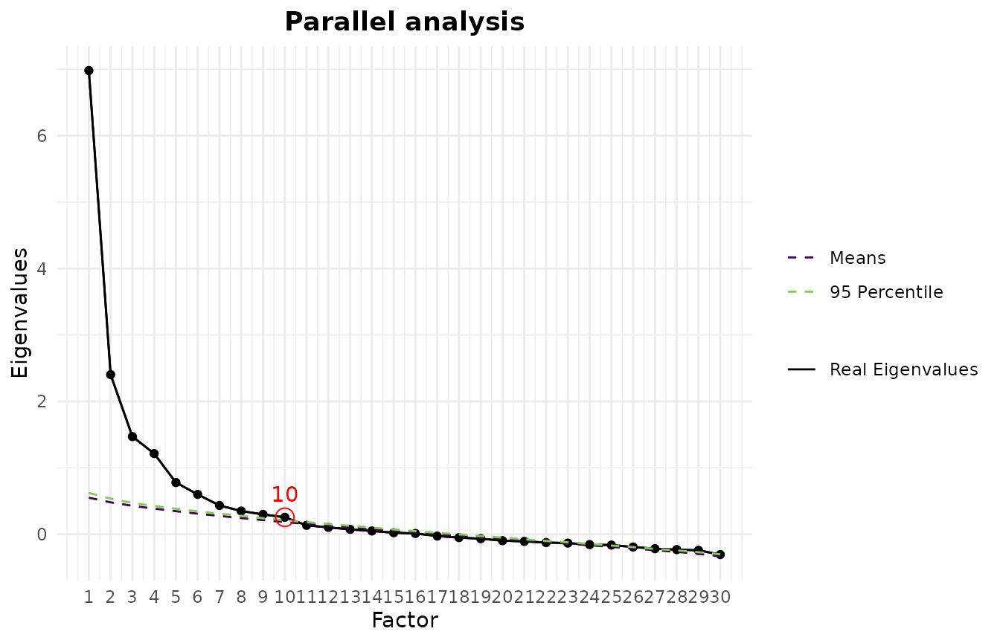
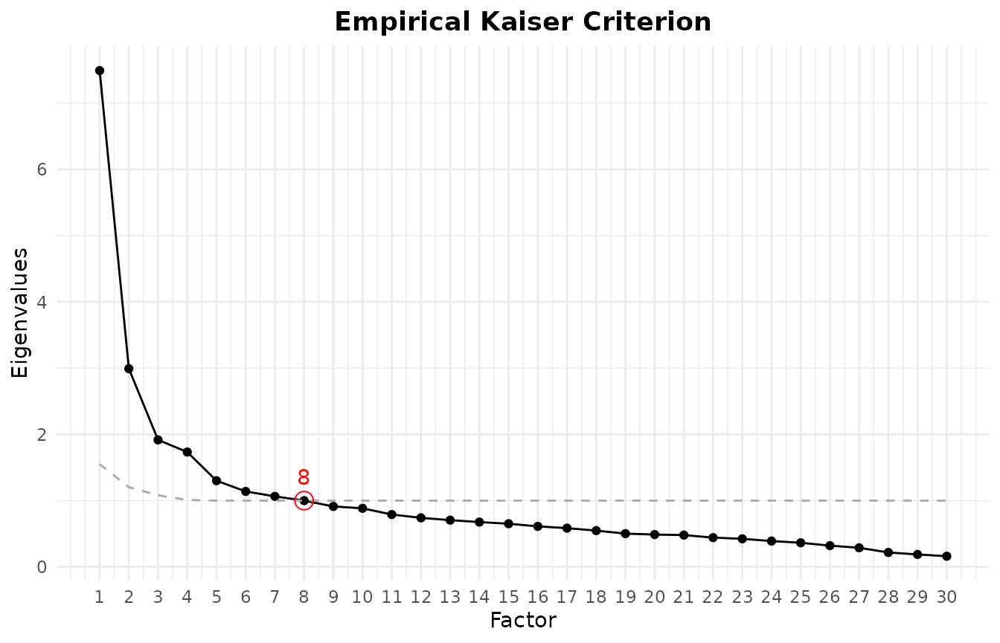
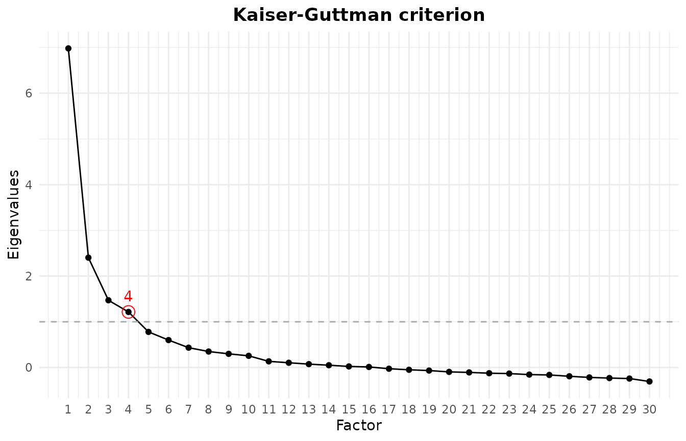
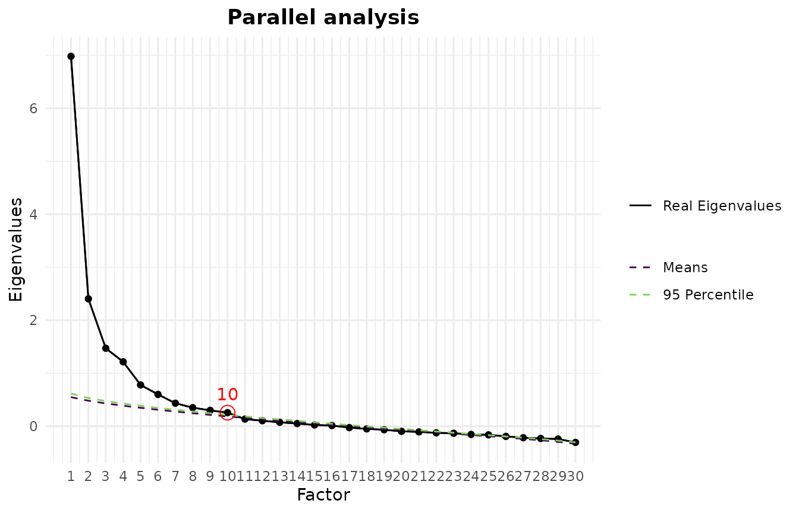

# EFAtools

`EFAtools` provides a complete workflow for exploratory factor analysis
(EFA). Starting from raw data or a correlation matrix, it takes you
through every stage of a typical analysis:

1.  **Screening** the data for factorability, multicollinearity,
    non-normality, and outliers
    ([`efa_screen()`](https://mdsteiner.github.io/EFAtools/reference/efa_screen.md),
    with
    [`efa_bartlett()`](https://mdsteiner.github.io/EFAtools/reference/efa_bartlett.md)
    and
    [`efa_kmo()`](https://mdsteiner.github.io/EFAtools/reference/efa_kmo.md)
    for the individual measures).
2.  **Retention**: deciding how many factors to keep, with a
    comprehensive suite of factor retention criteria
    ([`efa_retain()`](https://mdsteiner.github.io/EFAtools/reference/efa_retain.md)
    and the individual criteria it wraps).
3.  **Extraction and rotation** of the factor solution
    ([`efa_fit()`](https://mdsteiner.github.io/EFAtools/reference/efa_fit.md)),
    with a choice of estimators and orthogonal or oblique rotations.
4.  **Post-processing**: comparing solutions
    ([`efa_compare()`](https://mdsteiner.github.io/EFAtools/reference/efa_compare.md)),
    averaging across analytic choices
    ([`efa_average()`](https://mdsteiner.github.io/EFAtools/reference/efa_average.md)),
    estimating factor scores
    ([`efa_scores()`](https://mdsteiner.github.io/EFAtools/reference/efa_scores.md)),
    a Schmid-Leiman transformation
    ([`efa_schmid_leiman()`](https://mdsteiner.github.io/EFAtools/reference/efa_schmid_leiman.md)),
    and reliability coefficients including McDonald’s omegas
    ([`efa_reliability()`](https://mdsteiner.github.io/EFAtools/reference/efa_reliability.md)).

The computationally intensive routines are implemented in C++ for speed.
This vignette walks through the whole workflow on a single data set; it
is an overview rather than a tutorial on the methods themselves, so
please consult the individual help pages for the statistical details and
literature references.

The package can be installed from CRAN using
`install.packages("EFAtools")`, or from GitHub using
`pak::pak("mdsteiner/EFAtools")`, and then loaded using:

``` r

library(EFAtools)
```

We use the `DOSPERT_raw` data set throughout, which contains responses
of 3123 participants to the Domain Specific Risk Taking Scale (DOSPERT);
see
[`?DOSPERT_raw`](https://mdsteiner.github.io/EFAtools/reference/DOSPERT_raw.md)
for details. The data are rather large, so, purely to keep this vignette
quick to build, we work with the first 500 observations. In a real
analysis you would of course use the full data set.

``` r

# only use a subset to make analyses faster
DOSPERT_sub <- DOSPERT_raw[1:500, ]
```

## Screening the Data

Before extracting factors it is worth checking whether the data are
suitable for factor analysis, and whether they satisfy the assumptions
of the estimator you plan to use.
[`efa_screen()`](https://mdsteiner.github.io/EFAtools/reference/efa_screen.md)
collects the relevant diagnostics in one place. From raw data it reports
the Kaiser-Meyer-Olkin (KMO) measure of sampling adequacy (overall and
per variable), Bartlett’s test of sphericity, the determinant and
condition number of the correlation matrix, the squared multiple
correlation (SMC) and per-variable diagnostics for each item, tests of
multivariate normality (Mardia and Henze-Zirkler), and multivariate
outliers, and it closes with a set of recommendations.

``` r

efa_screen(DOSPERT_sub, seed = 2)
#> 
#> ── Sampling adequacy and sphericity ────────────────────────────────────────────
#> 
#> ✔ The overall KMO value for your data is meritorious (Overall KMO = 0.87).
#> These data are probably suitable for factor analysis.
#> 
#> ✔ The Bartlett's test of sphericity was significant at an alpha level of .05.
#> These data are probably suitable for factor analysis.
#> χ²(435) = 5843.05, p < .001
#> 
#> ── Multicollinearity ───────────────────────────────────────────────────────────
#> 
#> ✖ Determinant: 0.00000634. Multicollinearity likely (a value near 0 signals
#> it).
#> ✔ Condition number: 46.561 (condition index 6.824). No concern (index below 10;
#> Belsley, Kuh & Welsch, 1980).
#> 
#> ── Per-variable diagnostics ────────────────────────────────────────────────────
#> 
#>        variance missing%   SMC   MSA  flags
#> ethR_1    2.785        0 0.428 0.908       
#> ethR_2    2.469        0 0.312 0.927       
#> ethR_3    1.274        0 0.444 0.906 sparse
#> ethR_4    2.011        0 0.317 0.818 sparse
#> ethR_5    2.202        0 0.310 0.926       
#> ethR_6    3.457        0 0.398 0.837       
#> finR_1    1.962        0 0.683 0.880       
#> finR_2    3.223        0 0.319 0.816       
#> finR_3    2.356        0 0.716 0.853       
#> finR_4    2.874        0 0.519 0.857       
#> finR_5    2.458        0 0.760 0.853       
#> finR_6    3.118        0 0.515 0.861       
#> heaR_1    4.016        0 0.296 0.912       
#> heaR_2    4.532        0 0.277 0.898       
#> heaR_3    2.888        0 0.366 0.892       
#> heaR_4    2.185        0 0.423 0.889       
#> heaR_5    4.099        0 0.254 0.882       
#> heaR_6    3.356        0 0.313 0.935       
#> recR_1    4.570        0 0.374 0.888       
#> recR_2    2.829        0 0.465 0.927       
#> recR_3    3.664        0 0.511 0.905       
#> recR_4    4.362        0 0.687 0.849       
#> recR_5    3.741        0 0.685 0.840       
#> recR_6    4.076        0 0.541 0.920       
#> socR_1    1.237        0 0.351 0.714 sparse
#> socR_2    2.774        0 0.434 0.784       
#> socR_3    2.148        0 0.343 0.735       
#> socR_4    2.751        0 0.359 0.791       
#> socR_5    3.562        0 0.284 0.840       
#> socR_6    2.529        0 0.379 0.786       
#> 
#> ── Multivariate normality ──────────────────────────────────────────────────────
#> 
#> ✖ Mardia's skewness: χ²(4960) = 11585.82, p < .001.
#> ✖ Mardia's kurtosis: z = 43.84, p < .001.
#> ✖ Henze-Zirkler: HZ = 1.03, p < .001.
#> These data depart from multivariate normality.
#> 
#> ── Outliers ────────────────────────────────────────────────────────────────────
#> 
#> ! A robust (MCD) covariance could not be computed; classical Mahalanobis
#> distances were used.
#> At least half the complete cases lie exactly on a lower-dimensional hyperplane
#> (an "exact fit"). This is common with coarse discrete items, where many
#> respondents give identical answers on an item pair; it does not mean the data
#> are collinear at the correlation level.
#> These distances come from a covariance the outliers themselves inflate, so the
#> diagnostic is no longer high-breakdown and tends to under-flag.
#> ℹ 60 of 500 observations were flagged as multivariate outliers (Mahalanobis
#> distance > 6.85).
#> 
#> ── Recommendations ─────────────────────────────────────────────────────────────
#> 
#> ! These data depart from multivariate normality; normal-theory standard errors
#>   and fit statistics may be biased - prefer robust (sandwich) or bootstrapped
#>   standard errors.
#> ! Bartlett's test is significant, but it assumes multivariate normality and
#>   grows more sensitive as N increases; because these data are non-normal, treat
#>   it as uninformative here and rely on the KMO.
#> ! A near-zero determinant or high condition number indicates multicollinearity;
#>   look for redundant or linearly dependent items (r > .8) and consider removing
#>   them.
#> ! 3 variables have a sparse response category (< 5 responses): ethR_3, ethR_4,
#>   and socR_1; a low-frequency category can destabilise polychoric estimates -
#>   consider collapsing it into an adjacent category.
#> ! 60 observations were flagged as potential multivariate outliers; inspect them
#>   (see `$outliers$flagged`) before down-weighting or excluding.
```

The overall KMO is meritorious and Bartlett’s test is clearly
significant, so the data are factorable. The near-zero determinant flags
some multicollinearity, which is expected for a scale with strongly
related items within each risk domain. More interesting are the last few
sections: three items have a sparse response category, and both the
Mardia and the Henze-Zirkler tests reject multivariate normality. A
consequence is that normal-theory standard errors and fit indices may be
biased, so robust (sandwich) or bootstrapped standard errors are
preferable, and Bartlett’s test should be read with caution. For a fully
ordinal treatment you would move to polychoric correlations with a
categorical least-squares estimator.

On the outlier section: The robust distances come from a minimum
covariance determinant (MCD) estimate, whose random subset search is the
reason
[`efa_screen()`](https://mdsteiner.github.io/EFAtools/reference/efa_screen.md)
takes a `seed`. The MCD assumes roughly elliptical data, and on markedly
non-normal data like these, large robust distances are common. This is
why almost half of the observations end up flagged (On such heavily
discretised data the most robust 50% subset can also turn out singular,
in which case
[`efa_screen()`](https://mdsteiner.github.io/EFAtools/reference/efa_screen.md)
falls back to classical Mahalanobis distances and labels the output
accordingly). The flagged cases are therefore better understood as
evidence of that non-normality than as genuine outliers to remove.
Inspect them (via `$outliers$flagged`) rather than deleting them
automatically.

If you only want the two classic factorability tests, they are also
available on their own. Bartlett’s test of sphericity checks whether the
correlation matrix differs from an identity matrix (it should be
significant), and the KMO criterion summarises how strongly each
variable is predicted by the others:

``` r

# Bartlett's test of sphericity
efa_bartlett(DOSPERT_sub)
#> 
#> ✔ The Bartlett's test of sphericity was significant at an alpha level of .05.
#> These data are probably suitable for factor analysis.
#> 
#> χ²(435) = 5843.05, p < .001

# KMO criterion
efa_kmo(DOSPERT_sub)
#> 
#> ── Kaiser-Meyer-Olkin criterion (KMO) ──────────────────────────────────────────
#> 
#> ✔ The overall KMO value for your data is meritorious.
#> These data are probably suitable for factor analysis.
#> 
#> Overall: 0.87
#> 
#> For each variable:
#> ethR_1 ethR_2 ethR_3 ethR_4 ethR_5 ethR_6 finR_1 finR_2 finR_3 finR_4 finR_5 
#>  0.908  0.927  0.906  0.818  0.926  0.837  0.880  0.816  0.853  0.857  0.853 
#> finR_6 heaR_1 heaR_2 heaR_3 heaR_4 heaR_5 heaR_6 recR_1 recR_2 recR_3 recR_4 
#>  0.861  0.912  0.898  0.892  0.889  0.882  0.935  0.888  0.927  0.905  0.849 
#> recR_5 recR_6 socR_1 socR_2 socR_3 socR_4 socR_5 socR_6 
#>  0.840  0.920  0.714  0.784  0.735  0.791  0.840  0.786
```

Both tests can also be requested directly inside
[`efa_retain()`](https://mdsteiner.github.io/EFAtools/reference/efa_retain.md),
alongside the factor retention criteria discussed next.

## Deciding How Many Factors to Retain

One of the most consequential decisions in an EFA is how many factors to
extract. There is a large number of factor retention criteria, and no
single one dominates the others: which criterion works best depends on
the structure of the data — how many indicators there are, how strong
the factors are, and how strongly they intercorrelate. The current
recommendation is therefore to examine several criteria together and
check whether they converge (see, for example, [Auerswald and Moshagen,
2019](https://doi.org/10.1037/met0000200)).

`EFAtools` implements a broad set of these criteria. They can be called
individually, or all (or a selection) of them together through
[`efa_retain()`](https://mdsteiner.github.io/EFAtools/reference/efa_retain.md).

### Calling Individual Criteria

Each criterion has its own function. For a parallel analysis based on
squared multiple correlations (SMC; also called parallel analysis with
principal factors), for example, you would run:

``` r

# parallel analysis based on SMC eigenvalues
pa <- efa_parallel(DOSPERT_sub, eigen_type = "smc")
pa
#> ── Parallel analysis ───────────────────────────────────────────────────────────
#> Eigenvalues found using SMC; 1000 simulated datasets.
#> 
#> • SMC eigenvalues: 10
#> 
#> ℹ Number of factors retained using the "means" decision rule.
```

Printing the result reports the suggested number of factors. Each
criterion also has a
[`plot()`](https://rdrr.io/r/graphics/plot.default.html) method that
draws the figure behind the decision — for a parallel analysis, the
observed eigenvalues against the reference eigenvalues from the
simulated data:

``` r

plot(pa)
```



Other criteria work the same way. The empirical Kaiser criterion, for
instance:

``` r

# empirical Kaiser criterion
efa_ekc(DOSPERT_sub)
#> ── Empirical Kaiser Criterion ──────────────────────────────────────────────────
#> 
#> • Original implementation (Braeken & van Assen, 2017): 8
#> 
#> ℹ Multiple implementations of EKC exist; make sure to report which one you used
#> (see the efa_ekc help page for details).
```

The following criteria are currently implemented: comparison data
([`efa_cd()`](https://mdsteiner.github.io/EFAtools/reference/efa_cd.md)),
the empirical Kaiser criterion
([`efa_ekc()`](https://mdsteiner.github.io/EFAtools/reference/efa_ekc.md)),
the hull method
([`efa_hull()`](https://mdsteiner.github.io/EFAtools/reference/efa_hull.md)),
the Kaiser-Guttman criterion
([`efa_kgc()`](https://mdsteiner.github.io/EFAtools/reference/efa_kgc.md)),
the minimum average partial test
([`efa_map()`](https://mdsteiner.github.io/EFAtools/reference/efa_map.md)),
the next eigenvalue sufficiency test
([`efa_nest()`](https://mdsteiner.github.io/EFAtools/reference/efa_nest.md)),
parallel analysis
([`efa_parallel()`](https://mdsteiner.github.io/EFAtools/reference/efa_parallel.md)),
the scree test
([`efa_scree()`](https://mdsteiner.github.io/EFAtools/reference/efa_scree.md)),
and sequential model tests
([`efa_smt()`](https://mdsteiner.github.io/EFAtools/reference/efa_smt.md)).
Many of them offer several variants of the underlying method. For
instance, parallel analysis, can be based on eigenvalues from unity
(principal components), SMCs, or a full EFA. See the individual help
pages for the options.

### Running Several Criteria at Once with `efa_retain()`

To compare criteria, it is easier to call
[`efa_retain()`](https://mdsteiner.github.io/EFAtools/reference/efa_retain.md),
a wrapper around the implemented retention criteria that also runs
Bartlett’s test and computes the KMO. You can pick a subset with the
`criteria` argument:

``` r

ret <- efa_retain(DOSPERT_sub,
                  criteria = c("parallel", "ekc", "kgc", "smt", "map"))
#> Warning: The sequential model tests selected an inadmissible solution: chi: 13 factors
#> (Heywood case) and AIC: 13 factors (Heywood case).
#> ℹ The selected solution has a Heywood case or did not converge, so the
#>   suggested number of factors may be unreliable; interpret it with caution and
#>   cross-check with other criteria.
ret
#> ── Tests for the suitability of the data for factor analysis ───────────────────
#> 
#> ✔ The Bartlett's test of sphericity was significant at an alpha level of .05:
#>   χ²(435) = 5843.05, p < .001. These data are probably suitable for factor
#>   analysis.
#> ✔ The Kaiser-Meyer-Olkin criterion is meritorious (KMO = 0.87). These data are
#>   probably suitable for factor analysis.
#> 
#> ── Suggested number of factors ─────────────────────────────────────────────────
#> 
#> 8 suggestions from 5 criteria, ranging from 4 to 13 factors.
#> 
#> Empirical Kaiser Criterion
#> • Original implementation (Braeken & van Assen, 2017): 8
#> 
#> Kaiser-Guttman criterion
#> • SMC eigenvalues: 4
#> 
#> Minimum average partial
#> • Original implementation (TR2): 6
#> • Revised implementation (TR4): 6
#> 
#> Parallel analysis
#> • SMC eigenvalues: 10
#> 
#> Sequential model tests
#> • Sequential chi-square model tests: 13
#> • Lower bound of RMSEA 90% CI: 6
#> • Akaike Information Criterion: 13
```

The printed summary is text only, so the scree test’s suggestion to
inspect the plot needs an explicit call.
[`plot()`](https://rdrr.io/r/graphics/plot.default.html) on the result
draws the figure for every criterion that has one:

``` r

plot(ret)
#> $EKC
```



    #> 
    #> $KGC



    #> 
    #> $PARALLEL



Omitting `criteria` runs the full suite, including the hull method, the
next eigenvalue sufficiency test, and comparison data; the latter is
computationally expensive and can be slow on larger data sets, which is
why we leave it out here.

This is the situation one would rather avoid, but it does happen: the
criteria disagree, with suggestions ranging from four to well above ten
factors. When there is no clear convergence, the choice becomes partly a
matter of judgement. We proceed with six factors, consistent with the
minimum average partial test and the RMSEA-based sequential model test
above (note that this DOSPERT version assumes 5 factors, 6 factors
splits the financial risk items into two factors).

All criteria except comparison data (which needs raw data) can also be
applied to a correlation matrix, in which case the sample size must be
supplied. On a cleaner data set the criteria often agree:

``` r

efa_retain(test_models$baseline$cormat, N = 500, estimator = "uls",
           criteria = c("parallel", "ekc", "smt"),
           eigen_type_other = c("smc", "pca"))
#> ── Tests for the suitability of the data for factor analysis ───────────────────
#> 
#> ✔ The Bartlett's test of sphericity was significant at an alpha level of .05:
#>   χ²(153) = 2173.28, p < .001. These data are probably suitable for factor
#>   analysis.
#> ✔ The Kaiser-Meyer-Olkin criterion is marvellous (KMO = 0.916). These data are
#>   probably suitable for factor analysis.
#> 
#> ── Suggested number of factors ─────────────────────────────────────────────────
#> 
#> 6 suggestions from 3 criteria, ranging from 2 to 3 factors (most common: 3).
#> 
#> Empirical Kaiser Criterion
#> • Original implementation (Braeken & van Assen, 2017): 3
#> 
#> Parallel analysis
#> • PCA eigenvalues: 3
#> • SMC eigenvalues: 3
#> 
#> Sequential model tests
#> • Sequential chi-square model tests: 3
#> • Lower bound of RMSEA 90% CI: 2
#> • Akaike Information Criterion: 3
```

Here the criteria agree on three factors, with only the conservative
RMSEA lower-bound variant of the sequential model test suggesting two.

## Extracting Factors with `efa_fit()`

[`efa_fit()`](https://mdsteiner.github.io/EFAtools/reference/efa_fit.md)
performs the factor extraction and rotation. For extraction you can
choose principal axis factoring (PAF), maximum likelihood (ML), or
unweighted least squares (ULS, also known as MINRES); diagonally
weighted least squares (DWLS) is additionally available for ordinal data
analysed with polychoric or tetrachoric correlations (see the [EFA with
ordinal and missing
data](https://mdsteiner.github.io/EFAtools/articles/Ordinal_and_missing_data.md)
vignette). For rotation the package offers varimax and promax as well as
a range of further orthogonal and oblique rotations (e.g., quartimax,
equamax, oblimin, quartimin, geomin, bentler, bifactor, and simplimax),
all computed by rotation engines built into the package.

An EFA with PAF and no rotation is as simple as:

``` r

efa_fit(DOSPERT_sub, n_factors = 6)
#> 
#> EFA performed with estimator = 'PAF' and rotation = 'none'.
#> 
#> ── Unrotated Loadings ──────────────────────────────────────────────────────────
#> 
#>          F1     F2     F3     F4     F5     F6    h2    u2
#> ethR_1  .558  -.193   .141   .232  -.129   .049  .442  .558
#> ethR_2  .472  -.157   .073   .242   .037   .059  .316  .684
#> ethR_3  .507  -.402   .164   .112  -.087   .062  .470  .530
#> ethR_4  .308  -.278   .189   .294  -.103   .224  .356  .644
#> ethR_5  .459  -.173   .202   .042  -.082   .045  .292  .708
#> ethR_6  .412  -.308   .230   .201  -.066   .207  .405  .595
#> finR_1  .602  -.304  -.461  -.045   .244   .028  .730  .270
#> finR_2  .294   .281  -.255  -.066  -.341   .086  .359  .641
#> finR_3  .626  -.285  -.471  -.031   .264   .114  .778  .222
#> finR_4  .557  -.012  -.357  -.023  -.437  -.063  .633  .367
#> finR_5  .657  -.342  -.491  -.064   .218   .028  .842  .158
#> finR_6  .551   .157  -.341  -.007  -.429  -.082  .635  .365
#> heaR_1  .464  -.079   .047   .133   .010   .046  .244  .756
#> heaR_2  .409  -.020   .163   .229   .040   .068  .252  .748
#> heaR_3  .497  -.101   .172   .127   .007  -.325  .409  .591
#> heaR_4  .547  -.110   .183   .038   .070  -.322  .455  .545
#> heaR_5  .382   .002   .175   .250   .028   .010  .240  .760
#> heaR_6  .504   .063   .102   .015   .006  -.196  .307  .693
#> recR_1  .443   .337   .057  -.064   .007  -.063  .322  .678
#> recR_2  .617  -.012   .147  -.141   .126  -.232  .493  .507
#> recR_3  .612   .178   .103  -.247   .080  -.153  .507  .493
#> recR_4  .634   .228   .254  -.447   .033   .235  .774  .226
#> recR_5  .640   .135   .267  -.463   .051   .261  .784  .216
#> recR_6  .629   .238   .135  -.244  -.060  -.014  .534  .466
#> socR_1  .075   .528  -.024   .233   .213   .124  .400  .600
#> socR_2  .358   .428  -.083   .247   .147   .013  .401  .599
#> socR_3  .118   .528  -.160   .122   .044   .116  .348  .652
#> socR_4  .235   .481  -.057   .214   .166  -.093  .372  .628
#> socR_5  .317   .330   .014   .154  -.030   .002  .234  .766
#> socR_6  .260   .462  -.058   .267  -.023   .082  .363  .637
#> 
#> Legend:
#>   bold = |loading| >= .300
#>   grey = below cutoff
#>   red h2/u2 = Heywood-relevant value
#> 
#> ── Variances Accounted for ─────────────────────────────────────────────────────
#> 
#>                      F1     F2     F3     F4    F5     F6
#> SS loadings        7.013  2.417  1.529  1.246  .850   .641
#> Prop Tot Var        .234   .081   .051   .042  .028   .021
#> Cum Prop Tot Var    .234   .314   .365   .407  .435   .457
#> Prop Comm Var       .512   .177   .112   .091  .062   .047
#> Cum Prop Comm Var   .512   .689   .800   .891  .953  1.000
#> 
#> ── Model Fit ───────────────────────────────────────────────────────────────────
#> 
#> CAF: .48
#> SRMR: .03
#> df: 270
```

To rotate the loadings, set the `rotation` argument. Here we use a
promax rotation. We assign the result, as later sections reuse this
solution:

``` r

efa_dospert <- efa_fit(DOSPERT_sub, n_factors = 6, rotation = "promax")
efa_dospert
#> 
#> EFA performed with estimator = 'PAF' and rotation = 'promax'.
#> 
#> ── Rotated Loadings ────────────────────────────────────────────────────────────
#> 
#>           F1     F2     F3     F4     F5     F6    h2    u2
#> ethR_1   .547  -.025  -.020   .130   .009   .122  .442  .558
#> ethR_2   .447  -.055   .132   .098   .115  -.043  .316  .684
#> ethR_3   .532   .045   .068   .117  -.212   .030  .470  .530
#> ethR_4   .695  -.035  -.039  -.162   .000  -.002  .356  .644
#> ethR_5   .382   .159  -.051   .130  -.100   .036  .292  .708
#> ethR_6   .664   .086  -.003  -.089  -.063  -.044  .405  .595
#> finR_1  -.015  -.019   .853   .022   .003   .008  .730  .270
#> finR_2  -.050   .121  -.044  -.211   .120   .599  .359  .641
#> finR_3   .046   .035   .895  -.094   .061  -.011  .778  .222
#> finR_4   .039  -.071   .098   .035  -.102   .768  .633  .367
#> finR_5  -.006  -.010   .887   .023  -.038   .057  .842  .158
#> finR_6  -.022  -.051   .023   .061   .031   .774  .635  .365
#> heaR_1   .318   .042   .111   .091   .092   .019  .244  .756
#> heaR_2   .416   .020  -.003   .093   .191  -.081  .252  .748
#> heaR_3   .133  -.140  -.071   .674  -.036  -.009  .409  .591
#> heaR_4   .074  -.031  -.006   .697  -.067  -.074  .455  .545
#> heaR_5   .385  -.037  -.053   .170   .197  -.072  .240  .760
#> heaR_6   .044   .062  -.026   .455   .059   .048  .307  .693
#> recR_1  -.067   .253  -.060   .219   .247   .094  .322  .678
#> recR_2  -.046   .231   .089   .574  -.046  -.090  .493  .507
#> recR_3  -.155   .402   .053   .423   .035   .011  .507  .493
#> recR_4   .042   .926  -.010  -.089   .002  -.017  .774  .226
#> recR_5   .088   .945   .034  -.114  -.065  -.058  .784  .216
#> recR_6  -.020   .510  -.067   .212   .053   .154  .534  .466
#> socR_1   .016   .029   .025  -.137   .679  -.162  .400  .600
#> socR_2   .057  -.035   .103   .072   .602  -.020  .401  .599
#> socR_3  -.084   .061   .029  -.199   .559   .110  .348  .652
#> socR_4  -.090  -.082   .023   .197   .583  -.057  .372  .628
#> socR_5   .097   .032  -.086   .077   .370   .117  .234  .766
#> socR_6   .134  -.035  -.072  -.079   .568   .142  .363  .637
#> 
#> Legend:
#>   bold = |loading| >= .300
#>   grey = below cutoff
#>   red h2/u2 = Heywood-relevant value
#> 
#> ── Factor Intercorrelations ────────────────────────────────────────────────────
#> 
#>       F1     F2     F3     F4     F5     F6
#> F1  1.000
#> F2   .357  1.000
#> F3   .455   .349  1.000
#> F4   .567   .594   .502  1.000
#> F5   .031   .316   .046   .287  1.000
#> F6   .329   .441   .463   .486   .324  1.000
#> 
#> ── Variances Accounted for ─────────────────────────────────────────────────────
#> 
#>                      F1     F2     F3     F4     F5     F6
#> SS loadings        2.565  2.518  2.457  2.225  2.213  1.717
#> Prop Tot Var        .086   .084   .082   .074   .074   .057
#> Cum Prop Tot Var    .086   .169   .251   .326   .399   .457
#> Prop Comm Var       .187   .184   .179   .162   .162   .125
#> Cum Prop Comm Var   .187   .371   .551   .713   .875  1.000
#> 
#> ── Model Fit ───────────────────────────────────────────────────────────────────
#> 
#> CAF: .48
#> SRMR: .03
#> df: 270
```

We can also use a different estimator and rotation, here for example ULS
and an oblimin rotation:

``` r

efa_uls <- efa_fit(DOSPERT_sub, n_factors = 6, rotation = "oblimin", estimator = "uls")
efa_uls
#> 
#> EFA performed with estimator = 'ULS' and rotation = 'oblimin'.
#> 
#> ── Rotated Loadings ────────────────────────────────────────────────────────────
#> 
#>           F1     F2     F3     F4     F5     F6    h2    u2
#> ethR_1   .039   .009   .522  -.007   .137   .146  .441  .559
#> ethR_2   .166  -.025   .419   .100   .097  -.008  .316  .684
#> ethR_3   .120   .064   .511  -.220   .115   .052  .470  .530
#> ethR_4  -.013  -.038   .644  -.031  -.104   .008  .356  .644
#> ethR_5  -.003   .177   .371  -.103   .126   .059  .292  .708
#> ethR_6   .029   .084   .620  -.086  -.048  -.025  .405  .595
#> finR_1   .850  -.013  -.012   .003   .004   .028  .729  .271
#> finR_2  -.022   .102  -.039   .106  -.137   .551  .358  .642
#> finR_3   .883   .028   .039   .054  -.088   .007  .778  .222
#> finR_4   .160  -.054   .063  -.109   .068   .725  .634  .366
#> finR_5   .890  -.005  -.002  -.037   .006   .073  .842  .158
#> finR_6   .085  -.028   .005   .023   .092   .737  .636  .364
#> heaR_1   .144   .064   .302   .083   .091   .046  .244  .756
#> heaR_2   .029   .047   .389   .176   .095  -.043  .252  .748
#> heaR_3   .011  -.044   .154  -.016   .558   .051  .409  .591
#> heaR_4   .073   .060   .101  -.041   .571  -.008  .455  .545
#> heaR_5  -.016   .002   .362   .185   .158  -.031  .240  .760
#> heaR_6   .035   .123   .064   .074   .382   .092  .307  .693
#> recR_1  -.024   .282  -.050   .254   .193   .122  .322  .678
#> recR_2   .153   .295  -.014  -.016   .467  -.028  .493  .507
#> recR_3   .105   .441  -.118   .062   .348   .056  .507  .493
#> recR_4   .010   .881   .053   .014  -.060   .001  .774  .226
#> recR_5   .052   .897   .095  -.053  -.084  -.039  .786  .214
#> recR_6  -.016   .524   .004   .068   .191   .178  .534  .466
#> socR_1  -.004   .033  -.010   .656  -.104  -.134  .400  .600
#> socR_2   .109   .000   .043   .585   .074   .018  .401  .599
#> socR_3   .009   .054  -.095   .539  -.147   .110  .348  .652
#> socR_4   .031  -.034  -.091   .576   .169  -.015  .372  .628
#> socR_5  -.061   .059   .091   .359   .086   .137  .234  .766
#> socR_6  -.064  -.017   .114   .542  -.036   .155  .363  .637
#> 
#> Legend:
#>   bold = |loading| >= .300
#>   grey = below cutoff
#>   red h2/u2 = Heywood-relevant value
#> 
#> ── Factor Intercorrelations ────────────────────────────────────────────────────
#> 
#>       F1     F2     F3     F4     F5     F6
#> F1  1.000
#> F2   .303  1.000
#> F3   .379   .272  1.000
#> F4   .017   .245   .030  1.000
#> F5   .367   .412   .436   .173  1.000
#> F6   .353   .353   .186   .282   .238  1.000
#> 
#> ── Variances Accounted for ─────────────────────────────────────────────────────
#> 
#>                      F1     F2     F3     F4     F5     F6
#> SS loadings        2.749  2.655  2.465  2.162  1.869  1.797
#> Prop Tot Var        .092   .088   .082   .072   .062   .060
#> Cum Prop Tot Var    .092   .180   .262   .334   .397   .457
#> Prop Comm Var       .201   .194   .180   .158   .136   .131
#> Cum Prop Comm Var   .201   .395   .574   .732   .869  1.000
#> 
#> ── Model Fit ───────────────────────────────────────────────────────────────────
#> 
#> χ²(270) = 618.06, p < .001
#> CFI: .93
#> TLI: .89
#> RMSEA [90% CI]: .05 [.05; .06]
#> AIC: 78.06
#> BIC: -1059.88
#> ECVI: 2.02
#> CAF: .48
#> SRMR: .03
```

Note that `estimator = "uls"` was written in lowercase although the
canonical spelling is `"ULS"`. This holds throughout the `efa_*`
interface: wherever an argument takes a fixed set of values,
capitalization does not matter, while the result stores and prints the
canonical spelling. For an argument that takes a single value an
unambiguous abbreviation is enough as well, and a value matching nothing
raises an error naming the argument and listing the choices. Arguments
that take several values at once, such as the analytic choices
[`efa_average()`](https://mdsteiner.github.io/EFAtools/reference/efa_average.md)
averages over, need the full spelling of each value.

## Comparing Solutions with `efa_compare()`

[`efa_compare()`](https://mdsteiner.github.io/EFAtools/reference/efa_compare.md)
provides a quick way to see how similar two loading (pattern) matrices
are — whether they come from different implementations, different
estimators, or different rotations. For instance, to compare the
PAF/promax solution with the ULS/oblimin one:

``` r

efa_compare(efa_dospert$rot_loadings, efa_uls$rot_loadings,
            x_labels = c("PAF and promax", "ULS and oblimin"))
#> 
#> ── Summary statistics ──────────────────────────────────────────────────────────
#> 
#> Mean [min, max] absolute difference:  .0278 [ .0001,  .1262]
#> Median absolute difference:  .0226
#> Root mean squared distance (RMSE):  .0359
#> Max decimals where all numbers agree in absolute value: 0
#> Differing indicator-to-factor correspondences: 1 (highest loading), 0 (all |loadings| >= 0.3)
#> 
#> ── Elementwise differences ─────────────────────────────────────────────────────
#> 
#>           F1      F2      F3      F4      F5      F6
#> ethR_1   .0244  -.0335  -.0590  -.0073   .0157  -.0248
#> ethR_2   .0274  -.0299  -.0345   .0006   .0153  -.0348
#> ethR_3   .0208  -.0194  -.0522   .0025   .0073  -.0224
#> ethR_4   .0509   .0033  -.0253  -.0578   .0306  -.0099
#> ethR_5   .0110  -.0174  -.0482   .0045   .0028  -.0227
#> ethR_6   .0434   .0018  -.0325  -.0408   .0224  -.0190
#> finR_1  -.0027  -.0061   .0021   .0175  -.0001  -.0201
#> finR_2  -.0116   .0192  -.0214  -.0742   .0142   .0478
#> finR_3   .0072   .0077   .0114  -.0060   .0069  -.0179
#> finR_4  -.0240  -.0170  -.0625  -.0334   .0071   .0427
#> finR_5  -.0046  -.0054  -.0032   .0162  -.0006  -.0168
#> finR_6  -.0267  -.0230  -.0624  -.0316   .0075   .0378
#> heaR_1   .0156  -.0223  -.0331   .0003   .0095  -.0269
#> heaR_2   .0272  -.0276  -.0316  -.0019   .0148  -.0376
#> heaR_3  -.0213  -.0955  -.0820   .1154  -.0202  -.0595
#> heaR_4  -.0269  -.0912  -.0791   .1262  -.0266  -.0660
#> heaR_5   .0226  -.0393  -.0376   .0123   .0119  -.0404
#> heaR_6  -.0202  -.0618  -.0610   .0728  -.0150  -.0437
#> recR_1  -.0171  -.0288  -.0354   .0253  -.0074  -.0280
#> recR_2  -.0327  -.0634  -.0637   .1076  -.0301  -.0612
#> recR_3  -.0370  -.0393  -.0520   .0750  -.0277  -.0450
#> recR_4  -.0107   .0446  -.0201  -.0293  -.0118  -.0187
#> recR_5  -.0075   .0487  -.0177  -.0300  -.0117  -.0186
#> recR_6  -.0249  -.0134  -.0510   .0203  -.0149  -.0238
#> socR_1   .0259  -.0045   .0287  -.0333   .0225  -.0286
#> socR_2   .0137  -.0351  -.0068  -.0020   .0166  -.0377
#> socR_3   .0111   .0072   .0203  -.0524   .0206   .0005
#> socR_4   .0005  -.0483  -.0079   .0283   .0065  -.0417
#> socR_5   .0058  -.0272  -.0242  -.0084   .0114  -.0191
#> socR_6   .0199  -.0179  -.0076  -.0427   .0257  -.0124
```

## Averaging Across Analytic Choices with `efa_average()`

Comparing two solutions by hand answers the question for those two.
[`efa_average()`](https://mdsteiner.github.io/EFAtools/reference/efa_average.md)
asks it across a whole grid at once: it runs an EFA for every
combination of the settings you allow it to vary, averages the loadings
across the solutions that converged, and reports the range each loading
spans. That range is the useful part — it shows how much of the result
is the data and how much is the analytic choice. Here we vary only the
estimator, keeping one implementation each of PAF, ULS, and ML with a
promax rotation:

``` r

avg_dospert <- efa_average(DOSPERT_sub, n_factors = 6,
                           estimator = c("paf", "uls", "ml"),
                           type = "EFAtools", start_method = "psych")
avg_dospert
#> 
#> Averaging performed with averaging method mean (trim = 0) across 3 EFAs,
#> varying the following settings: estimator.
#> 
#> The error rate is at 0%. Of the solutions that did not result in an error, 100%
#> converged. Of the solutions that converged, 0% contained Heywood cases and 100%
#> were admissible.
#> 
#> ══ Indicator-to-Factor Correspondences ═════════════════════════════════════════
#> 
#> For each cell, the proportion of solutions including the respective
#> indicator-to-factor correspondence. A salience threshold of 0.3 was used to
#> determine indicator-to-factor correspondences.
#> 
#>          F1    F2    F3    F4    F5    F6
#> ethR_1  1.00   .00   .00   .00   .00   .00
#> ethR_2  1.00   .00   .00   .00   .00   .00
#> ethR_3  1.00   .00   .00   .00   .00   .00
#> ethR_4  1.00   .00   .00   .00   .00   .00
#> ethR_5  1.00   .00   .00   .00   .00   .00
#> ethR_6  1.00   .00   .00   .00   .00   .00
#> finR_1   .00   .00  1.00   .00   .00   .00
#> finR_2   .00   .00   .00   .00   .00  1.00
#> finR_3   .00   .00  1.00   .00   .00   .00
#> finR_4   .00   .00   .00   .00   .00  1.00
#> finR_5   .00   .00  1.00   .00   .00   .00
#> finR_6   .00   .00   .00   .00   .00  1.00
#> heaR_1  1.00   .00   .00   .00   .00   .00
#> heaR_2  1.00   .00   .00   .00   .00   .00
#> heaR_3   .00   .00   .00  1.00   .00   .00
#> heaR_4   .00   .00   .00  1.00   .00   .00
#> heaR_5  1.00   .00   .00   .00   .00   .00
#> heaR_6   .00   .00   .00  1.00   .00   .00
#> recR_1   .00   .00   .00   .33   .00   .00
#> recR_2   .00   .00   .00  1.00   .00   .00
#> recR_3   .00   .67   .00  1.00   .00   .00
#> recR_4   .00  1.00   .00   .00   .00   .00
#> recR_5   .00  1.00   .00   .00   .00   .00
#> recR_6   .00  1.00   .00   .00   .00   .00
#> socR_1   .00   .00   .00   .00  1.00   .00
#> socR_2   .00   .00   .00   .00  1.00   .00
#> socR_3   .00   .00   .00   .00  1.00   .00
#> socR_4   .00   .00   .00   .00  1.00   .00
#> socR_5   .00   .00   .00   .00  1.00   .00
#> socR_6   .00   .00   .00   .00  1.00   .00
#> 
#> ══ Loadings ════════════════════════════════════════════════════════════════════
#> 
#> ── Mean ────────────────────────────────────────────────────────────────────────
#> 
#>           F1     F2     F3     F4     F5     F6
#> ethR_1   .548  -.039  -.024   .142   .011   .117
#> ethR_2   .454  -.048   .133   .081   .117  -.042
#> ethR_3   .535   .038   .064   .122  -.213   .030
#> ethR_4   .691  -.018  -.038  -.173   .001  -.006
#> ethR_5   .395   .160  -.051   .119  -.094   .035
#> ethR_6   .672   .089  -.003  -.100  -.058  -.043
#> finR_1  -.017  -.022   .850   .035   .002   .004
#> finR_2  -.060   .116  -.045  -.193   .120   .597
#> finR_3   .044   .037   .893  -.087   .062  -.011
#> finR_4   .041  -.064   .095   .026  -.103   .771
#> finR_5  -.004  -.008   .886   .022  -.037   .056
#> finR_6  -.018  -.052   .020   .057   .032   .777
#> heaR_1   .312   .034   .106   .104   .088   .023
#> heaR_2   .417   .024  -.004   .084   .191  -.076
#> heaR_3   .148  -.144  -.065   .649  -.037  -.006
#> heaR_4   .095  -.032  -.001   .665  -.067  -.070
#> heaR_5   .383  -.041  -.052   .175   .194  -.074
#> heaR_6   .053   .040  -.024   .461   .058   .049
#> recR_1  -.079   .216  -.065   .273   .242   .089
#> recR_2  -.049   .196   .085   .617  -.054  -.096
#> recR_3  -.160   .357   .052   .478   .030   .004
#> recR_4   .041   .916  -.010  -.065   .004  -.013
#> recR_5   .086   .929   .034  -.082  -.062  -.055
#> recR_6  -.012   .495  -.063   .220   .056   .157
#> socR_1   .013   .025   .024  -.128   .679  -.160
#> socR_2   .068  -.031   .098   .062   .604  -.015
#> socR_3  -.087   .065   .035  -.196   .560   .109
#> socR_4  -.084  -.089   .018   .201   .579  -.053
#> socR_5   .094   .023  -.081   .094   .368   .106
#> socR_6   .132  -.029  -.068  -.077   .564   .138
#> 
#> ── Range (max − min) ───────────────────────────────────────────────────────────
#> 
#>          F1    F2    F3    F4    F5    F6
#> ethR_1  .004  .044  .011  .037  .006  .015
#> ethR_2  .022  .022  .005  .051  .006  .003
#> ethR_3  .010  .021  .013  .015  .002  .001
#> ethR_4  .011  .051  .003  .032  .004  .013
#> ethR_5  .038  .002  .002  .033  .017  .005
#> ethR_6  .025  .011  .000  .034  .015  .002
#> finR_1  .008  .010  .009  .040  .005  .012
#> finR_2  .029  .015  .003  .053  .001  .004
#> finR_3  .008  .004  .007  .022  .005  .002
#> finR_4  .006  .022  .009  .026  .003  .010
#> finR_5  .007  .006  .002  .000  .002  .001
#> finR_6  .012  .005  .008  .010  .004  .007
#> heaR_1  .016  .024  .015  .039  .011  .012
#> heaR_2  .003  .015  .004  .027  .001  .015
#> heaR_3  .045  .013  .017  .074  .005  .010
#> heaR_4  .063  .002  .015  .094  .000  .013
#> heaR_5  .006  .011  .005  .013  .008  .008
#> heaR_6  .026  .064  .006  .016  .003  .003
#> recR_1  .037  .112  .016  .162  .014  .016
#> recR_2  .007  .106  .012  .128  .022  .018
#> recR_3  .015  .136  .003  .163  .013  .021
#> recR_4  .003  .029  .001  .072  .006  .014
#> recR_5  .006  .052  .002  .097  .009  .008
#> recR_6  .027  .046  .011  .024  .011  .007
#> socR_1  .010  .012  .002  .027  .003  .008
#> socR_2  .034  .012  .015  .028  .006  .016
#> socR_3  .009  .014  .018  .008  .001  .004
#> socR_4  .018  .018  .015  .012  .012  .012
#> socR_5  .010  .025  .013  .049  .006  .035
#> socR_6  .008  .017  .012  .005  .010  .014
#> 
#> ══ Factor Intercorrelations from Oblique Solutions ═════════════════════════════
#> 
#> ── Mean ────────────────────────────────────────────────────────────────────────
#> 
#>       F1     F2     F3     F4     F5     F6
#> F1  1.000
#> F2   .342  1.000
#> F3   .456   .334  1.000
#> F4   .565   .592   .496  1.000
#> F5   .026   .307   .040   .291  1.000
#> F6   .331   .429   .463   .493   .320  1.000
#> 
#> ── Range (max − min) ───────────────────────────────────────────────────────────
#> 
#>      F1    F2    F3    F4    F5    F6
#> F1  .000
#> F2  .045  .000
#> F3  .003  .045  .000
#> F4  .005  .005  .017  .000
#> F5  .016  .027  .017  .013  .000
#> F6  .005  .036  .000  .019  .011  .000
#> 
#> ══ Variances Accounted for ═════════════════════════════════════════════════════
#> 
#> ── Mean ────────────────────────────────────────────────────────────────────────
#> 
#>                  F1     F2     F3     F4     F5     F6
#> SS loadings    2.599  2.405  2.447  2.320  2.206  1.716
#> Prop Tot Var    .087   .080   .082   .077   .074   .057
#> Prop Comm Var   .190   .176   .179   .169   .161   .125
#> 
#> ── Range (max − min) ───────────────────────────────────────────────────────────
#> 
#>                 F1    F2    F3    F4    F5    F6
#> SS loadings    .099  .336  .030  .284  .022  .005
#> Prop Tot Var   .003  .011  .001  .009  .001  .000
#> Prop Comm Var  .007  .024  .002  .021  .001  .000
#> 
#> ══ Model Fit ═══════════════════════════════════════════════════════════════════
#> 
#> The fit indices are the mean of the per-solution fit indices, not the fit of
#> the averaged loadings printed above, which are a cell-wise summary rather than
#> a fitted solution.
#> 
#> Chi-square-based indices averaged over 2 of 3 solutions.
#> CAF, RMSR, and SRMR averaged over 3 of 3 solutions.
#> 
#>        M (SD) [Min; Max]
#> χ²: 613.61 ( 6.30) [609.15; 618.06]
#> df: 270
#> p: .000 (.000) [.000; .000]
#> CFI: .93 (.00) [.93; .94]
#> TLI: .89 (.00) [.89; .90]
#> RMSEA: .05 (.00) [.05; .05]
#> AIC: 73.61 ( 6.30) [69.15; 78.06]
#> BIC: -1064.34 ( 6.30) [-1068.80; -1059.88]
#> ECVI:  2.01 ( 0.01) [ 2.00;  2.02]
#> CAF: .48 (.00) [.48; .48]
#> RMSR: .03 (.00) [.03; .03]
#> SRMR: .03 (.00) [.03; .03]
```

Left unrestricted, the defaults sweep the different implementations of
principal axis factoring and promax rotation instead, which is
considerably more work; see
[`?efa_average`](https://mdsteiner.github.io/EFAtools/reference/efa_average.md)
for the settings that can be varied and for
[`plot()`](https://rdrr.io/r/graphics/plot.default.html), which shows
the minimum, maximum, and average loading of every indicator.

## Factor Scores with `efa_scores()`

If you need factor scores,
[`efa_scores()`](https://mdsteiner.github.io/EFAtools/reference/efa_scores.md)
estimates them directly from an
[`efa_fit()`](https://mdsteiner.github.io/EFAtools/reference/efa_fit.md)
solution, and reports score-quality diagnostics (determinacy,
univocality, and the Guttman indeterminacy index):

``` r

fac_scores <- efa_scores(DOSPERT_sub, f = efa_dospert)
fac_scores
#> 
#> ── Factor scores (regression) ──────────────────────────────────────────────────
#> 
#> Scored 500 observations on 6 factors.
#> 
#> ── Score determinacy ───────────────────────────────────────────────────────────
#> 
#>      rho  rho2  guttman
#> F1  .903  .815     .629
#> F2  .951  .905     .810
#> F3  .961  .923     .846
#> F4  .910  .829     .658
#> F5  .887  .787     .574
#> F6  .907  .822     .644
```

## Schmid-Leiman Transformation and McDonald’s Omegas

For the Schmid-Leiman transformation and the omega coefficients we
return to the PAF/promax solution (`efa_dospert`) from above. Its
indicator names encode the risk domain each item belongs to (ethical,
financial, health, recreational, and social), and its pattern
coefficients recovered these theoretical domains fairly well: items from
the same domain tend to load on the same factor. The factor
intercorrelations also included some sizeable values, which raises the
question of whether a general factor underlies the domains. A
Schmid-Leiman transformation lets us examine that.

### Schmid-Leiman Transformation

The Schmid-Leiman (SL) transformation orthogonalises an oblique solution
into a hierarchical one with a general factor and orthogonalised group
factors.
[`efa_schmid_leiman()`](https://mdsteiner.github.io/EFAtools/reference/efa_schmid_leiman.md)
performs it:

``` r

sl_dospert <- efa_schmid_leiman(efa_dospert)
sl_dospert
#> 
#> EFA for second-order loadings performed with estimator = 'PAF'
#> 
#> ── Schmid-Leiman Solution ──────────────────────────────────────────────────────
#> 
#>           g     F1     F2     F3     F4     F5     F6    h2    u2
#> ethR_1  .487   .440  -.018  -.016   .067   .009   .093  .445  .555
#> ethR_2  .400   .360  -.041   .104   .050   .110  -.033  .318  .682
#> ethR_3  .441   .428   .033   .054   .060  -.202   .023  .427  .573
#> ethR_4  .225   .559  -.026  -.031  -.084   .000  -.001  .372  .628
#> ethR_5  .406   .308   .119  -.041   .067  -.095   .028  .290  .710
#> ethR_6  .325   .534   .064  -.003  -.046  -.060  -.034  .402  .598
#> finR_1  .523  -.012  -.014   .676   .011   .003   .006  .731  .269
#> finR_2  .266  -.041   .090  -.035  -.109   .114   .458  .316  .684
#> finR_3  .528   .037   .026   .709  -.049   .058  -.008  .789  .211
#> finR_4  .529   .032  -.053   .078   .018  -.097   .587  .643  .357
#> finR_5  .574  -.005  -.008   .703   .012  -.036   .043  .827  .173
#> finR_6  .528  -.018  -.038   .018   .031   .029   .592  .633  .367
#> heaR_1  .403   .256   .031   .088   .047   .088   .014  .246  .754
#> heaR_2  .344   .335   .015  -.002   .048   .182  -.062  .270  .730
#> heaR_3  .503   .107  -.104  -.056   .347  -.034  -.007  .400  .600
#> heaR_4  .548   .060  -.023  -.005   .359  -.064  -.057  .441  .559
#> heaR_5  .331   .310  -.028  -.042   .088   .187  -.055  .254  .746
#> heaR_6  .491   .036   .046  -.021   .235   .056   .037  .304  .696
#> recR_1  .417  -.054   .189  -.047   .113   .235   .072  .288  .712
#> recR_2  .601  -.037   .172   .071   .296  -.044  -.069  .492  .508
#> recR_3  .589  -.125   .299   .042   .218   .033   .008  .503  .497
#> recR_4  .550   .034   .689  -.008  -.046   .002  -.013  .780  .220
#> recR_5  .549   .071   .704   .027  -.059  -.062  -.044  .812  .188
#> recR_6  .585  -.016   .380  -.053   .109   .050   .118  .518  .482
#> socR_1  .030   .013   .021   .020  -.071   .646  -.124  .439  .561
#> socR_2  .306   .046  -.026   .081   .037   .573  -.015  .433  .567
#> socR_3  .081  -.068   .045   .023  -.103   .532   .084  .315  .685
#> socR_4  .217  -.073  -.061   .018   .102   .555  -.044  .376  .624
#> socR_5  .282   .078   .023  -.068   .040   .352   .090  .225  .775
#> socR_6  .211   .108  -.026  -.057  -.040   .540   .109  .366  .634
#> 
#> ── Variances Accounted for ─────────────────────────────────────────────────────
#> 
#>                      g      F1     F2     F3    F4     F5     F6
#> SS loadings        5.710  1.550  1.327  1.518  .553  1.994  1.000
#> Prop Tot Var        .190   .052   .044   .051  .018   .066   .033
#> Cum Prop Tot Var    .190   .242   .286   .337  .355   .422   .455
#> Prop Comm Var       .418   .113   .097   .111  .040   .146   .073
#> Cum Prop Comm Var   .418   .532   .629   .740  .781   .927  1.000
```

The general-factor column shows that the items load substantially on the
general factor across all domains except the social one, whose items
load least strongly on it on average (mean general-factor loading around
.19, against roughly .38 to .55 in the other domains) — that is, the
non-social domains covary considerably, while the social domain stands
somewhat apart. Individual social items vary considerably around that
average, so this is a statement about the domain and not about every
item in it.

### McDonald’s Omegas

Finally,
[`efa_reliability()`](https://mdsteiner.github.io/EFAtools/reference/efa_reliability.md)
computes omega estimates and related indices from the SL solution. You
can either specify the indicator-to-factor correspondences via the
`factor_map` argument or let the function determine them automatically,
in which case each indicator is assigned to its highest-loading factor.
With a reasonably simple structure here, it is easiest to leave
`factor_map` unspecified — a few items do land on a neighbouring
domain’s factor, which is exactly what motivates the explicit map shown
afterwards:

``` r

efa_reliability(sl_dospert)
#> 
#> Total variance from the correlation matrix.
#> 
#> ── Reliability coefficients ────────────────────────────────────────────────────
#> 
#>      tot  hier   sub  alpha    H
#> g   .922  .718  .177   .886  .886
#> F1  .791  .377  .415   .788  .652
#> F2  .867  .474  .393   .845  .683
#> F3  .912  .344  .568   .914  .739
#> F4  .709  .531  .177   .716  .305
#> F5  .739  .124  .615   .741  .726
#> F6  .745  .295  .451   .742  .571
#> 
#> ── Common-variance indices ─────────────────────────────────────────────────────
#> 
#>     ECV   PUC
#> g  .418  .828
```

To set the correspondences explicitly instead — for example to match a
theoretical assignment — pass a `factor_map` matrix:

``` r

efa_reliability(sl_dospert,
  factor_map = matrix(c(rep(1, 6), rep(0, 24),                  # F1: ethical
                        rep(0, 18), rep(1, 6), rep(0, 6),       # F2: recreational
                        rep(0, 6), 1, 0, 1, 0, 1, rep(0, 19),   # F3: financial (1, 3, 5)
                        rep(0, 12), rep(1, 6), rep(0, 12),      # F4: health
                        rep(0, 24), rep(1, 6),                  # F5: social
                        rep(0, 7), 1, 0, 1, 0, 1, rep(0, 18)),  # F6: financial (2, 4, 6)
                      ncol = 6, byrow = FALSE))
#> 
#> Total variance from the correlation matrix.
#> 
#> ── Reliability coefficients ────────────────────────────────────────────────────
#> 
#>      tot  hier   sub  alpha    H
#> g   .922  .718  .150   .886  .886
#> F1  .737  .317  .420   .763  .611
#> F2  .828  .535  .292   .844  .689
#> F3  .912  .344  .568   .914  .739
#> F4  .567  .479  .088   .697  .262
#> F5  .742  .082  .660   .735  .722
#> F6  .745  .295  .451   .742  .571
#> 
#> ── Common-variance indices ─────────────────────────────────────────────────────
#> 
#>     ECV   PUC
#> g  .418  .848
```

The columns of `factor_map` are matched to the group factors **by
position**, so the assignment has to be read off the solution rather
than assumed: a column naming the wrong set of items yields a
well-formed but meaningless subscale omega instead of an error.
Comparing the two tables, the health row is the one that moves most:
three of the six health items load higher on the ethical factor than on
the health one, so pinning all six to F4 lowers that subscale’s omega
relative to the automatic assignment.

## Where to Next

This vignette covered the core workflow. `EFAtools` goes further in
several directions, each of which has its own vignette or article:

- [EFA with ordinal and missing
  data](https://mdsteiner.github.io/EFAtools/articles/Ordinal_and_missing_data.md):
  analysing ordinal items with polychoric correlations and handling
  missing data.
- [Migrating to the efa\_\*
  interface](https://mdsteiner.github.io/EFAtools/articles/Migrating_to_efa.md):
  a guide for users coming from the older uppercase function names.
- [Multigroup
  EFA](https://mdsteiner.github.io/EFAtools/articles/Multigroup_EFA.html)
  (on the package website): comparing factor structures across groups.
- [Simulation and
  power](https://mdsteiner.github.io/EFAtools/articles/Simulation_and_power.html)
  (on the package website): simulating data and running power analyses
  for EFA.

Run `browseVignettes("EFAtools")` to see the vignettes installed with
the package, or visit the [package
website](https://mdsteiner.github.io/EFAtools/) for the full set of
articles.
