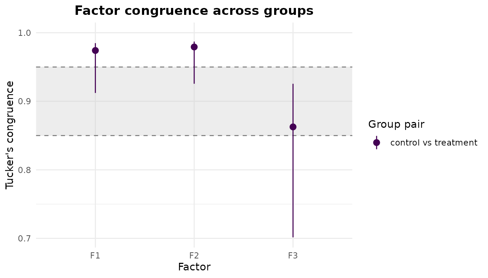
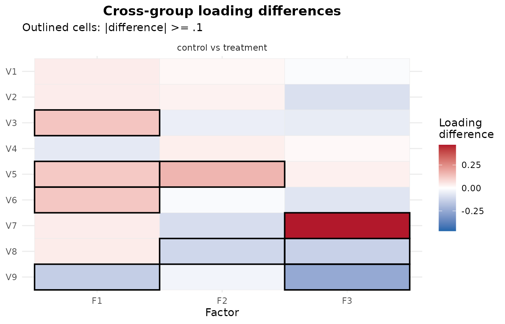

# Multigroup exploratory factor analysis

When the same set of items is administered to several groups – age
bands, treatment arms, translated versions of a questionnaire – a
natural question is whether the items measure the *same* factors in each
group.
[`efa_group()`](https://mdsteiner.github.io/EFAtools/reference/efa_group.md)
answers it by fitting an exploratory factor analysis in every group at a
common number of factors, bringing the per-group solutions into one
shared orientation, and then comparing their loadings.

The comparison is not as simple as extracting a solution in each group
and reading the loadings side by side. A factor solution is identified
only up to a rotation of its factors, so two groups can have identical
factor structures yet return loading matrices that look nothing alike –
the factors may be reflected, reordered, or rotated relative to one
another. Before the loadings can be compared they must be brought into a
common orientation. That alignment is what
[`efa_group()`](https://mdsteiner.github.io/EFAtools/reference/efa_group.md)
does for you, on top of the per-group fits, and it is the reason a
dedicated function is worth having.

``` r

library(EFAtools)
```

## Two groups with a known difference

To see the tools work we need groups whose factor structures we already
know, so we can check that the analysis recovers the difference we built
in. We simulate two groups from a three-factor model with
[`efa_simulate()`](https://mdsteiner.github.io/EFAtools/reference/efa_simulate.md).
Both groups share the same simple structure – three items per factor –
except in how factor 3 is built: in the **control** group item `V7` is
that factor’s strongest indicator, whereas in the **treatment** group
`V7` nearly drops off it and `V9` becomes the strongest instead. Factor
3 is therefore defined by a different item in each group, which should
lower its cross-group congruence and light up the per-item difference
flags – while factors 1 and 2, whose items are untouched, stay highly
congruent.

``` r

# Common simple structure: three items per factor.
Lambda_control <- matrix(0, nrow = 9, ncol = 3,
                         dimnames = list(paste0("V", 1:9), paste0("F", 1:3)))
Lambda_control[1:3, 1] <- c(.70, .65, .60)
Lambda_control[4:6, 2] <- c(.70, .65, .60)
Lambda_control[7:9, 3] <- c(.70, .65, .60)

# The treatment group is identical, except factor 3 is anchored by a different item:
# V7 nearly drops off it and V9 becomes its strongest indicator.
Lambda_treatment <- Lambda_control
Lambda_treatment["V7", 3] <- .20   # was .70
Lambda_treatment["V9", 3] <- .75   # was .60

Lambda_control
#>      F1   F2   F3
#> V1 0.70 0.00 0.00
#> V2 0.65 0.00 0.00
#> V3 0.60 0.00 0.00
#> V4 0.00 0.70 0.00
#> V5 0.00 0.65 0.00
#> V6 0.00 0.60 0.00
#> V7 0.00 0.00 0.70
#> V8 0.00 0.00 0.65
#> V9 0.00 0.00 0.60
Lambda_treatment
#>      F1   F2   F3
#> V1 0.70 0.00 0.00
#> V2 0.65 0.00 0.00
#> V3 0.60 0.00 0.00
#> V4 0.00 0.70 0.00
#> V5 0.00 0.65 0.00
#> V6 0.00 0.60 0.00
#> V7 0.00 0.00 0.20
#> V8 0.00 0.00 0.65
#> V9 0.00 0.00 0.75
```

Each group is drawn with its own seed so the example is fully
reproducible.

``` r

control   <- efa_simulate(N = 300, Lambda = Lambda_control,   seed = 1)$data
treatment <- efa_simulate(N = 300, Lambda = Lambda_treatment, seed = 2)$data

# efa_group() requires the same items, in the same order, in every group.
colnames(control)   <- rownames(Lambda_control)
colnames(treatment) <- rownames(Lambda_treatment)

groups <- list(control = control, treatment = treatment)
```

Groups can be supplied either as a single raw data set together with a
`groups` vector (one value per row), or – as here – as a named list of
per-group data sets. The list may also hold per-group correlation
matrices instead of raw data, in which case you pass their sample sizes
through `N`.

## Fitting at a common number of factors

[`efa_group()`](https://mdsteiner.github.io/EFAtools/reference/efa_group.md)
fits each group with
[`efa_fit()`](https://mdsteiner.github.io/EFAtools/reference/efa_fit.md)
at the common `n_factors`, forwarding any estimation and rotation
settings unchanged to every group. Here we extract three factors with a
varimax rotation.

``` r

mg <- efa_group(groups, n_factors = 3, rotation = "varimax")
mg
#> ── Multigroup exploratory factor analysis ──────────────────────────────────────
#> 
#> 2 groups (control, treatment) · 3 factors · PAF extraction · varimax rotation
#> Aligned to a symmetric consensus target.
#> N: control = 300, treatment = 300
#> 
#> ── Factor congruence ───────────────────────────────────────────────────────────
#> 
#> Tucker's congruence between the aligned group loadings (matched factors):
#> 
#>                        F1    F2    F3
#> control vs treatment  .974  .979  .863
#> 
#> ── Loading differences ─────────────────────────────────────────────────────────
#> 
#> Absolute loading differences by group pair (salience threshold |Δ| ≥ .1):
#> 
#>                       mean  median   min   max  rmse  flagged
#> control vs treatment  .089    .055  .012  .469  .129     9/27
```

The printed report recaps the groups and the shared model, then
summarises the two things we came for: the factor congruence between the
aligned groups, and the size of their loading differences. The aligned
per-group loading matrices are in `$loadings`, sharing one column order
and sign so they can be read against each other directly.

``` r

lapply(mg$loadings, round, 2)
#> $control
#>       F1    F2    F3
#> V1  0.00  0.67 -0.03
#> V2 -0.04  0.68  0.05
#> V3  0.09  0.61 -0.05
#> V4  0.67  0.00 -0.03
#> V5  0.75  0.02  0.08
#> V6  0.63  0.02 -0.03
#> V7 -0.02 -0.05  0.68
#> V8  0.04 -0.04  0.52
#> V9  0.02  0.02  0.59
#> 
#> $treatment
#>       F1    F2    F3
#> V1 -0.04  0.65 -0.01
#> V2 -0.08  0.65  0.14
#> V3 -0.04  0.65  0.01
#> V4  0.73 -0.04 -0.04
#> V5  0.63 -0.15  0.05
#> V6  0.50  0.03  0.04
#> V7 -0.06  0.05  0.21
#> V8  0.00  0.07  0.65
#> V9  0.16  0.05  0.85
```

Factors 1 and 2 line up closely across the groups. Factor 3 does not:
`V7` and `V9` have swapped prominence, exactly as we built in.

## Alignment: consensus versus reference

[`efa_group()`](https://mdsteiner.github.io/EFAtools/reference/efa_group.md)
chooses one of two alignment strategies automatically, and the report
tells you which one it used.

- **Consensus** (the default for orthogonal and unrotated solutions)
  builds a single symmetric target across *all* groups by generalized
  Procrustes analysis and rotates every group to it. That target is only
  identified up to a rotation of its factors, so
  [`efa_group()`](https://mdsteiner.github.io/EFAtools/reference/efa_group.md)
  fixes it in a canonical gauge – the simple structure of the rotation
  you asked for, evaluated on the target itself, so the shared loadings
  are the same kind of frame as the per-group solutions; or the target’s
  principal-axes orientation where no criterion identifies one, as for
  an unrotated solution – and applies the same transform to every group.
  The shared orientation, and hence the congruences and flags below,
  therefore does not depend on the order the groups are listed in. This
  is what the fit above used.
- **Reference** keeps one group’s loadings fixed and rotates every other
  group onto them. This path is used whenever you name a
  `reference_group`, and it is used *automatically* for oblique
  rotations, because the symmetric consensus target is not defined for
  oblique transformations with more than one factor.

When an oblique rotation triggers the reference path without an explicit
choice,
[`efa_group()`](https://mdsteiner.github.io/EFAtools/reference/efa_group.md)
reports which group it used and leaves the requested rotation untouched:

``` r

mg_obl <- efa_group(groups, n_factors = 3, rotation = "oblimin")
#> ℹ `x` is not a correlation matrix; computing correlations from the raw data.
#> ℹ `x` is not a correlation matrix; computing correlations from the raw data.
#> Oblique rotations are aligned to a reference group, not a symmetric consensus
#> target.
#> ℹ The consensus target is undefined for oblique rotations with more than one
#>   factor.
#> ℹ Group "control" is used as the reference; set `reference_group` to choose
#>   another.
mg_obl$settings$alignment
#> [1] "reference"
```

Supplying `reference_group` forces the reference path and chooses the
anchor yourself – by name or by position:

``` r

mg_ref <- efa_group(groups, n_factors = 3, rotation = "varimax",
                    reference_group = "control")
mg_ref$settings$alignment
#> [1] "reference"
```

## Factor congruence with bootstrap intervals

Cross-group factor similarity is quantified by Tucker’s congruence
coefficient between the aligned loadings – one value per matched factor,
per group pair. A congruence near 1 means the factor is defined by the
same items, in the same relative proportions, in both groups.

With raw data you can attach a percentile bootstrap confidence interval
to each congruence by setting `b_boot`. The bootstrap resamples cases
within each group, refits, re-aligns every replicate to the frozen
target, and recomputes the congruences; a `seed` makes it reproducible
and independent of any parallel backend.

``` r

mg_ci <- efa_group(groups, n_factors = 3, rotation = "varimax",
                   b_boot = 500, seed = 2026)
#> Warning: 7 of 500 bootstrap replicates did not converge.
#> ℹ Their bootstrap standard errors and confidence intervals may be unreliable.

mg_ci$congruence$matched["control", "treatment", ]
#>        F1        F2        F3 
#> 0.9741244 0.9792535 0.8626227
mg_ci$congruence$matched_ci$lower["control", "treatment", ]
#>        F1        F2        F3 
#> 0.9121723 0.9256080 0.7014900
mg_ci$congruence$matched_ci$upper["control", "treatment", ]
#>        F1        F2        F3 
#> 0.9848410 0.9871471 0.9255560
```

The [`plot()`](https://rdrr.io/r/graphics/plot.default.html) method
draws the matched congruences against the Lorenzo-Seva and ten Berge
(2006) similarity bands – `.95` and above reads as “equal”, `.85` to
`.95` as “fair” – so a factor’s cross-group similarity can be judged at
a glance. With a bootstrap the points carry their confidence intervals.

``` r

plot(mg_ci, type = "congruence")
```



Factors 1 and 2 sit at the top of the scale; factor 3, whose indicators
were rearranged, drops into or below the “fair” band.

## Loading differences: salient versus significant

Congruence summarises a whole factor. To see *which items* drive a
difference,
[`efa_group()`](https://mdsteiner.github.io/EFAtools/reference/efa_group.md)
also compares the aligned loadings cell by cell. `$diffs` gives a
per-pair magnitude summary, and `$flags` gives the signed difference for
every item on every factor.

An item is **flagged** when the groups’ aligned loadings differ by at
least `delta` (default `0.1`) in absolute value. This is a descriptive
*salience* threshold, not a significance test. When a bootstrap was run,
each difference additionally carries a confidence interval, and
`ci_excludes_0` reports whether that interval clears zero – the closest
thing to a significance statement. The two need not agree: a difference
can be large enough to flag yet have an interval spanning zero (salient
but uncertain), or small yet reliably non-zero.

``` r

mg_ci$diffs
#>   group_1   group_2 mean_abs_diff median_abs_diff min_abs_diff max_abs_diff
#> 1 control treatment    0.08894307       0.0553482   0.01150575    0.4687179
#>        rmse n_flagged
#> 1 0.1285639         9
```

The factor-3 cells for `V7` and `V9` stand out. Restricting `$flags` to
the flagged cells shows where the two notions of “different” line up:

``` r

flagged <- mg_ci$flags[mg_ci$flags$flagged, ]
flagged[, c("indicator", "factor", "diff", "ci_excludes_0")]
#>    indicator factor       diff ci_excludes_0
#> 3         V3     F1  0.1253052         FALSE
#> 5         V5     F1  0.1165165         FALSE
#> 6         V6     F1  0.1219350         FALSE
#> 9         V9     F1 -0.1409243          TRUE
#> 14        V5     F2  0.1607774          TRUE
#> 17        V8     F2 -0.1137431         FALSE
#> 25        V7     F3  0.4687179          TRUE
#> 26        V8     F3 -0.1318978         FALSE
#> 27        V9     F3 -0.2511814          TRUE
```

The `"differences"` plot lays the signed differences out as a heatmap,
one panel per group pair, outlining the cells that reach `delta`.

``` r

plot(mg_ci, type = "differences")
```



## An approximate-invariance verdict

For a compact summary, `invariance = TRUE` grades each factor’s
congruence against the Lorenzo-Seva and ten Berge (2006) bands and
returns a per-factor verdict: `"equal"` for a congruence of at least
`.95`, `"fair"` for `.85` to `.95`, and `"incongruent"` below that.

``` r

mg_inv <- efa_group(groups, n_factors = 3, rotation = "varimax",
                    b_boot = 500, seed = 2026, invariance = TRUE)
#> Warning: 7 of 500 bootstrap replicates did not converge.
#> ℹ Their bootstrap standard errors and confidence intervals may be unreliable.
mg_inv$invariance
#>   group_1   group_2 factor       phi phi_lower     verdict
#> 1 control treatment     F1 0.9741244 0.9121723        fair
#> 2 control treatment     F2 0.9792535 0.9256080        fair
#> 3 control treatment     F3 0.8626227 0.7014900 incongruent
```

When a bootstrap is available the verdict is read conservatively off the
*lower* bound of the congruence interval, so a factor is graded “equal”
only if even the lower bound clears the band. That is why factors 1 and
2 above – comfortably above `.95` as point estimates – are graded only
“fair”: their interval lower bounds slip below `.95`. This is
deliberately cautious, guarding against declaring invariance on the
strength of a point estimate that a modest resample could pull below the
threshold. Without a bootstrap the verdict falls back to the point
estimate, and the `phi_lower` column is left `NA` to signal the
non-conservative reading.

The verdict is a graded heuristic built on the congruence bands, not a
formal test of measurement invariance. It is a fast, exploratory read on
how comparable the factors are across groups – a confirmatory multigroup
model remains the tool for a formal invariance test.

## Where to next

[`efa_group()`](https://mdsteiner.github.io/EFAtools/reference/efa_group.md)
carries several further controls: `delta` to tune the salience
threshold, `ci` to set the interval level, and any
[`efa_fit()`](https://mdsteiner.github.io/EFAtools/reference/efa_fit.md)
argument (`estimator`, `cor_method`, an
[`estimate_control()`](https://mdsteiner.github.io/EFAtools/reference/estimate_control.md)
or
[`rotate_control()`](https://mdsteiner.github.io/EFAtools/reference/estimate_control.md))
to configure the per-group estimation. See
[`?efa_group`](https://mdsteiner.github.io/EFAtools/reference/efa_group.md)
for the full argument list and the structure of the returned object, and
the
[EFAtools](https://mdsteiner.github.io/EFAtools/articles/EFAtools.md)
vignette for the single-group workflow the per-group fits build on.

## References

Gower, J. C. (1975). Generalized Procrustes analysis. *Psychometrika*,
40, 33-51.

Lorenzo-Seva, U., & ten Berge, J. M. F. (2006). Tucker’s congruence
coefficient as a meaningful index of factor similarity. *Methodology*,
2, 57-64.
