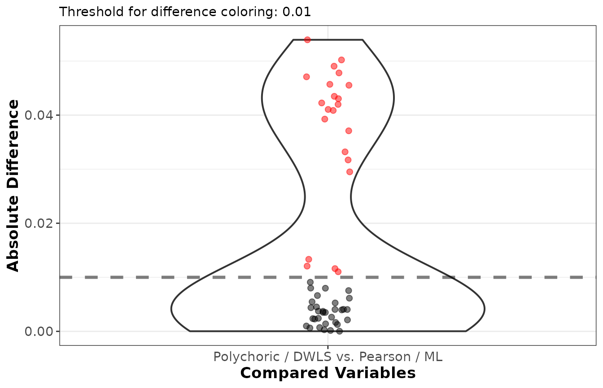

# EFA with ordinal and missing data

Two features of real data complicate an exploratory factor analysis:
items are often **ordinal** (a handful of Likert categories rather than
a continuous scale), and some responses are usually **missing**.
`EFAtools` handles both within the ordinary
[`efa_fit()`](https://mdsteiner.github.io/EFAtools/reference/efa_fit.md)
workflow, without switching packages. This vignette shows how. It
assumes familiarity with the basic workflow covered in the
[EFAtools](https://mdsteiner.github.io/EFAtools/articles/EFAtools.md)
vignette and focuses on what changes for ordinal and incomplete data.

``` r

library(EFAtools)
```

So that the examples are self-contained and reproducible, we generate
the data with
[`efa_simulate()`](https://mdsteiner.github.io/EFAtools/reference/efa_simulate.md)
from a known three-factor population (18 indicators, six per factor,
with moderately correlated factors), using fixed seeds throughout.

``` r

Lambda <- population_models$loadings$baseline  # 18 x 3 loading pattern
Phi    <- population_models$phis_3$moderate    # moderate factor intercorrelations
```

## Ordinal Data

Rating-scale items are not continuous: they take a few ordered values,
and a Pearson correlation between two such items underestimates the
association between the underlying constructs. The polychoric
correlation instead estimates the correlation of the continuous latent
variables assumed to underlie the observed categories, and pairing it
with a categorical estimator removes the bias that treating the items as
continuous introduces.

We draw 400 responses on a four-category scale. Because the latent data
are normal, cutting them at the standard-normal category thresholds
already leaves the population *polychoric* correlation of the
discretised data equal to the target correlation; `match = "polychoric"`
records that this is what we are after.

``` r

d_ord <- efa_simulate(N = 400, Lambda = Lambda, Phi = Phi,
                      categories = 4, match = "polychoric", seed = 2024)$data
d_ord[1:5, 1:6]
#>      V1 V2 V3 V4 V5 V6
#> [1,]  4  4  4  3  2  4
#> [2,]  3  1  1  1  3  1
#> [3,]  1  1  1  2  2  1
#> [4,]  4  4  3  4  4  3
#> [5,]  2  4  2  3  2  1
```

### Screening Ordinal Data

[`efa_screen()`](https://mdsteiner.github.io/EFAtools/reference/efa_screen.md)
reports, among its diagnostics, how many response categories each item
has and whether the data are multivariate normal — the two things that
decide whether an ordinal treatment is worthwhile.

``` r

efa_screen(d_ord, seed = 42)
#> 
#> ── Sampling adequacy and sphericity ────────────────────────────────────────────
#> 
#> ✔ The overall KMO value for your data is meritorious (Overall KMO = 0.828).
#> These data are probably suitable for factor analysis (verbal bands: Kaiser &
#> Rice, 1974).
#> 
#> ✔ The Bartlett's test of sphericity was significant at an alpha level of .05.
#> These data are probably suitable for factor analysis.
#> χ²(153) = 1306.76, p < .001
#> 
#> ── Multicollinearity ───────────────────────────────────────────────────────────
#> 
#> ℹ Determinant: 0.0357. It falls as variables are added, so the condition index
#> below carries the verdict.
#> ✔ Condition number: 7.919 (condition index 2.814). An index of 10 or less is
#> rarely of interest (Belsley, 1991).
#> 
#> ── Per-variable diagnostics ────────────────────────────────────────────────────
#> 
#>     variance missing%   SMC   MSA flags
#> V1     1.248        0 0.218 0.830      
#> V2     1.298        0 0.241 0.817      
#> V3     1.222        0 0.278 0.793      
#> V4     1.223        0 0.225 0.829      
#> V5     1.211        0 0.228 0.801      
#> V6     1.266        0 0.297 0.810      
#> V7     1.260        0 0.242 0.839      
#> V8     1.187        0 0.239 0.836      
#> V9     1.182        0 0.259 0.832      
#> V10    1.153        0 0.257 0.835      
#> V11    1.150        0 0.282 0.806      
#> V12    1.193        0 0.244 0.852      
#> V13    1.373        0 0.227 0.819      
#> V14    1.317        0 0.290 0.851      
#> V15    1.206        0 0.224 0.853      
#> V16    1.193        0 0.227 0.859      
#> V17    1.282        0 0.311 0.832      
#> V18    1.223        0 0.274 0.804      
#> 
#> ── Multivariate normality ──────────────────────────────────────────────────────
#> 
#> ✔ Mardia's skewness: χ²(1140) = 1016.6, p = 0.996.
#> ✖ Mardia's kurtosis: z = -5.79, p < .001.
#> ✖ Henze-Zirkler: HZ = 1, p < .001.
#> These data depart from multivariate normality: 2 of the 3 tests reject it.
#> 
#> ── Outliers ────────────────────────────────────────────────────────────────────
#> 
#> ℹ 4 of 400 observations were flagged as multivariate outliers (robust distance
#> > 5.61).
#> 
#> ── Recommendations ─────────────────────────────────────────────────────────────
#> 
#> ! 18 items have fewer than 5 response categories; treating them as ordinal
#>   (polychoric correlations with a categorical estimator such as DWLS) is less
#>   biased than normal-theory ML.
#> ! Bartlett's test is significant, but it assumes multivariate normality and
#>   grows more sensitive as N increases; because these data are non-normal, treat
#>   it as uninformative here and rely on the KMO.
#> ! 4 observations were flagged as potential multivariate outliers; inspect them
#>   (see `$outliers$flagged`) before down-weighting or excluding.
```

The sampling adequacy (KMO) and sphericity checks confirm the data are
factorable. The telling parts are the multivariate-normality section and
the recommendations: Mardia’s kurtosis and the Henze-Zirkler test reject
normality, and the recommendations flag that every item has fewer than
five response categories. Together, these point to the same conclusion.
With few categories and non-normal data, a polychoric correlation with a
categorical estimator such as DWLS is less biased than normal-theory
maximum likelihood. The normal-theory standard errors and fit indices
are also better replaced by robust (sandwich) versions.

### Polychoric Correlations, DWLS, and Robust Standard Errors

[`efa_fit()`](https://mdsteiner.github.io/EFAtools/reference/efa_fit.md)
computes the polychoric correlation when `cor_method = "poly"` and fits
it with diagonally weighted least squares when `estimator = "DWLS"` —
the estimator recommended for ordinal data because it accounts for how
precisely each polychoric correlation is estimated. Requesting
`se = "sandwich"` adds robust standard errors and a scaled
(Satorra-Bentler) chi-square that stay valid under the non-normality
these data show.

``` r

efa_poly <- efa_fit(d_ord, n_factors = 3, cor_method = "poly", estimator = "dwls",
                    rotation = "oblimin", se = "sandwich")
#> ℹ `x` is not a correlation matrix; computing correlations from
#> the raw data.
efa_poly
#> 
#> EFA performed with estimator = 'DWLS' and rotation = 'oblimin'.
#> 
#> ── Rotated Loadings ────────────────────────────────────────────────────────────
#> 
#>        F1     F2     F3    h2    u2
#> V1    .053   .028   .521  .297  .703
#> V2    .070  -.034   .569  .339  .661
#> V3    .092  -.063   .621  .403  .597
#> V4   -.068   .110   .560  .337  .663
#> V5   -.063  -.048   .621  .359  .641
#> V6   -.041   .047   .683  .471  .529
#> V7    .024   .577   .017  .348  .652
#> V8   -.002   .584   .014  .345  .655
#> V9   -.012   .630  -.022  .385  .615
#> V10   .045   .622  -.070  .389  .611
#> V11  -.063   .656   .032  .416  .584
#> V12   .067   .532   .052  .332  .668
#> V13   .533   .023   .018  .299  .701
#> V14   .665   .005   .012  .449  .551
#> V15   .576  -.021   .044  .338  .662
#> V16   .563   .014   .026  .331  .669
#> V17   .675   .031  -.015  .466  .534
#> V18   .642  -.002  -.063  .395  .605
#> 
#> Legend:
#>   bold = |loading| >= .300
#>   grey = below cutoff
#>   red h2/u2 = Heywood-relevant value
#> 
#> ── Factor Intercorrelations ────────────────────────────────────────────────────
#> 
#>       F1     F2     F3
#> F1  1.000
#> F2   .352  1.000
#> F3   .252   .254  1.000
#> 
#> ── Variances Accounted for ─────────────────────────────────────────────────────
#> 
#>                      F1     F2     F3
#> SS loadings        2.302  2.219  2.177
#> Prop Tot Var        .128   .123   .121
#> Cum Prop Tot Var    .128   .251   .372
#> Prop Comm Var       .344   .331   .325
#> Cum Prop Comm Var   .344   .675  1.000
#> 
#> ── Model Fit ───────────────────────────────────────────────────────────────────
#> 
#> scaled χ²(102) = 100.83, p = .514
#> CFI: 1.00
#> TLI: 1.00
#> RMSEA [90% CI]: .00 [.00; .03]
#> AIC: NA
#> BIC: NA
#> CAF: .51
#> SRMR: .03
```

The pattern matrix recovers the three factors cleanly (six indicators
each), and the model fit reports a **scaled** chi-square with its CFI,
TLI, and RMSEA. Because the chi-square is a scaled statistic, the AIC
and BIC (which are defined on the unscaled likelihood discrepancy) are
left `NA`.

For binary items, `cor_method = "tetra"` computes tetrachoric
correlations and runs the same DWLS and sandwich machinery.

The robust standard errors accompany each estimated quantity; for the
rotated loadings, for example:

``` r

round(efa_poly$SE$rot_loadings, 3)
#>        F1    F2    F3
#> V1  0.057 0.057 0.051
#> V2  0.057 0.054 0.051
#> V3  0.057 0.052 0.048
#> V4  0.055 0.055 0.052
#> V5  0.051 0.053 0.053
#> V6  0.052 0.052 0.049
#> V7  0.059 0.056 0.052
#> V8  0.051 0.053 0.048
#> V9  0.051 0.054 0.047
#> V10 0.052 0.054 0.050
#> V11 0.053 0.054 0.050
#> V12 0.058 0.054 0.054
#> V13 0.055 0.057 0.054
#> V14 0.051 0.055 0.052
#> V15 0.057 0.056 0.053
#> V16 0.056 0.057 0.049
#> V17 0.051 0.054 0.047
#> V18 0.056 0.055 0.049
```

The matching confidence intervals live in `efa_poly$CI`, and
`summary(efa_poly)` prints them as a labelled table alongside the model
diagnostics.

### Why Not Just Treat the Items as Continuous?

To see what the ordinal treatment buys, fit the same data as if they
were continuous — a Pearson correlation with maximum likelihood — and
compare the rotated loadings with
[`efa_compare()`](https://mdsteiner.github.io/EFAtools/reference/efa_compare.md).

``` r

efa_cont <- efa_fit(d_ord, n_factors = 3, cor_method = "pearson", estimator = "ML",
                    rotation = "oblimin")
#> ℹ `x` is not a correlation matrix; computing correlations from
#> the raw data.

cmp <- efa_compare(efa_poly$rot_loadings, efa_cont$rot_loadings,
                   x_labels = c("Polychoric / DWLS", "Pearson / ML"))
cmp
#> 
#> ── Summary statistics ──────────────────────────────────────────────────────────
#> 
#> Mean [min, max] absolute difference:  .0171 [ .0000,  .0539]
#> Median absolute difference:  .0064
#> Root mean squared distance (RMSE):  .0252
#> Max decimals where all numbers agree in absolute value: 0
#> Differing indicator-to-factor correspondences: 0 (highest loading),
#>   0 (all |loadings| >= 0.3)
#> 
#> ── Elementwise differences ─────────────────────────────────────────────────────
#> 
#> Differences: Polychoric / DWLS - Pearson / ML.
#> 
#>        F1      F2      F3
#> V1    .0066   .0024   .0317
#> V2    .0040  -.0061   .0332
#> V3    .0080  -.0055   .0455
#> V4   -.0053   .0121   .0435
#> V5   -.0013  -.0026   .0471
#> V6   -.0116   .0037   .0539
#> V7   -.0021   .0420   .0040
#> V8   -.0110   .0409   .0091
#> V9    .0044   .0371  -.0080
#> V10   .0003   .0491  -.0035
#> V11   .0035   .0411   .0010
#> V12   .0133   .0295  -.0023
#> V13   .0457   .0037  -.0041
#> V14   .0430  -.0007   .0075
#> V15   .0502   .0000   .0045
#> V16   .0393   .0016   .0014
#> V17   .0478   .0002  -.0041
#> V18   .0423  -.0006  -.0024
plot(cmp)
```



The two solutions agree on the structure, but the polychoric loadings
are systematically a little larger: treating the items as continuous
attenuates the loadings, because the Pearson correlation understates the
latent associations. With only four categories here the gap is modest,
but it widens as the number of categories drops (it is largest for
binary items) and as the category thresholds grow more asymmetric
(skewed items). This is why a polychoric or tetrachoric treatment is
preferable for genuinely ordinal items with few categories.

The polychoric route does make its own demands, though: it assumes a
normal latent variable underlies each item, and it needs an adequate
sample size and reasonably populated response-category combinations.
When categories are very sparse (rare responses, small samples), the
polychoric asymptotic covariance behind the DWLS weights and the robust
standard errors becomes unreliable, and collapsing rare categories can
help.

## Missing Data

When some responses are missing, dropping every incomplete case
(listwise deletion) wastes data and can bias the results unless the
values are missing completely at random. `EFAtools` offers two
principled alternatives that assume only that the data are missing at
random (MAR): a single-analysis route via full-information maximum
likelihood, and a multiple-imputation route via
[`efa_mi()`](https://mdsteiner.github.io/EFAtools/reference/efa_mi.md).

We simulate 250 continuous cases with about 15% of values missing at
random, where each item’s missingness depends on another item’s value.
By default,
[`efa_simulate()`](https://mdsteiner.github.io/EFAtools/reference/efa_simulate.md)
would make each item’s missingness depend on another item that is itself
partly missing — a kind of missingness the two routes below are not
designed for. Rather than failing outright, they run with a residual
bias that grows as `missing_prop` and `missing_strength` increase.

`missing_vars` and `missing_predictor` avoid that. Here the first nine
items carry the missing values and each is driven by one of the last
nine, which stay complete. Every predictor is therefore fully observed,
satisfying the *ignorable* MAR assumption the two routes below rely on –
not just MAR, but MAR with no incomplete predictor left unaccounted for.

``` r

d_miss <- efa_simulate(N = 250, Lambda = Lambda, Phi = Phi,
                       missing = "MAR", missing_prop = 0.15,
                       missing_vars = 1:9, missing_predictor = 10:18,
                       seed = 2024)$data
round(mean(is.na(d_miss)), 3)          # overall proportion missing
#> [1] 0.078
round(colMeans(is.na(d_miss)), 3)      # holed items only
#>    V1    V2    V3    V4    V5    V6    V7    V8    V9   V10   V11   V12   V13 
#> 0.172 0.132 0.184 0.160 0.140 0.152 0.156 0.156 0.144 0.000 0.000 0.000 0.000 
#>   V14   V15   V16   V17   V18 
#> 0.000 0.000 0.000 0.000 0.000
```

### Two-Stage Full-Information Maximum Likelihood

With `cor_method = "fiml"`,
[`efa_fit()`](https://mdsteiner.github.io/EFAtools/reference/efa_fit.md)
estimates the saturated mean and covariance from all the observed data
by an EM algorithm (assuming the data are MAR) and analyses the
resulting correlation — a single fit that uses every case rather than
only the complete ones. The model fit is reported as corrected two-stage
(Satorra-Bentler) statistics.

``` r

efa_fiml <- efa_fit(d_miss, n_factors = 3, cor_method = "fiml", estimator = "ml",
                    rotation = "oblimin")
#> ℹ `x` is not a correlation matrix; computing correlations from
#> the raw data.
efa_fiml
#> 
#> EFA performed with estimator = 'ML' and rotation = 'oblimin'.
#> Correlations: FIML (two-stage, missing data)
#> 
#> ── Rotated Loadings ────────────────────────────────────────────────────────────
#> 
#>        F1     F2     F3    h2    u2
#> V1   -.029   .554  -.029  .293  .707
#> V2    .069   .613  -.092  .402  .598
#> V3   -.008   .630  -.018  .391  .609
#> V4    .194   .515   .051  .388  .612
#> V5   -.044   .575   .013  .316  .684
#> V6   -.044   .647   .095  .423  .577
#> V7   -.034   .028   .578  .330  .670
#> V8   -.022   .006   .684  .462  .538
#> V9    .163   .022   .511  .335  .665
#> V10   .021   .001   .550  .309  .691
#> V11   .008  -.008   .589  .348  .652
#> V12  -.057  -.041   .577  .317  .683
#> V13   .590  -.061   .115  .371  .629
#> V14   .471   .185   .090  .351  .649
#> V15   .688  -.056  -.097  .427  .573
#> V16   .627  -.044   .003  .376  .624
#> V17   .677   .073  -.044  .485  .515
#> V18   .546   .072   .027  .340  .660
#> 
#> Legend:
#>   bold = |loading| >= .300
#>   grey = below cutoff
#>   red h2/u2 = Heywood-relevant value
#> 
#> ── Factor Intercorrelations ────────────────────────────────────────────────────
#> 
#>       F1     F2     F3
#> F1  1.000
#> F2   .358  1.000
#> F3   .247   .129  1.000
#> 
#> ── Variances Accounted for ─────────────────────────────────────────────────────
#> 
#>                      F1     F2     F3
#> SS loadings        2.339  2.206  2.119
#> Prop Tot Var        .130   .123   .118
#> Cum Prop Tot Var    .130   .252   .370
#> Prop Comm Var       .351   .331   .318
#> Cum Prop Comm Var   .351   .682  1.000
#> 
#> ── Model Fit ───────────────────────────────────────────────────────────────────
#> 
#> scaled χ²(102) = 111.53, p = .244
#> CFI: .99
#> TLI: .99
#> RMSEA [90% CI]: .02 [.00; .04]
#> AIC: NA
#> BIC: NA
#> CAF: .52
#> SRMR: .04
```

The solution again recovers the three factors, and the printout records
that the correlation was obtained by two-stage FIML. Standard errors are
available here too: for `estimator = "ML"` or `"ULS"`,
`se = "information"` or `"sandwich"` return the corrected two-stage
standard errors, and `se = "np-boot"` works with any estimator.

FIML estimates the model from every case, but it does not fill in the
missing values. Any step that needs complete rows is therefore still
complete-case. `efa_scores(d_miss, f = efa_fiml)`, for example, scores
only the complete cases and warns that the rest are `NA`:

``` r

sum(complete.cases(d_miss))    # cases a score can be formed for
#> [1] 63
```

Use the
[`efa_mi()`](https://mdsteiner.github.io/EFAtools/reference/efa_mi.md)
route below if you want case-level scores for every respondent. Each
imputed dataset is complete, so scoring it with the pooled loadings
covers all 250 cases.

The correction itself needs a well-behaved saturated covariance. When
that cannot be formed — typically in a small sample with a high
proportion of missing values, or with near-collinear items —
[`efa_fit()`](https://mdsteiner.github.io/EFAtools/reference/efa_fit.md)
warns and keeps the plain two-stage likelihood-ratio statistic instead
of discarding the test. Such a fit is never presented as corrected: the
printed chi-square line is labelled **uncorrected**, and the
accompanying *p*-value, CFI, TLI, and RMSEA should be read as indicative
only.

### Multiple Imputation with `efa_mi()`

The alternative is to impute the missing values several times, fit each
completed dataset, and pool the results. `EFAtools` does not impute the
data itself — use a dedicated tool such as the
[mice](https://CRAN.R-project.org/package=mice) package — but
[`efa_mi()`](https://mdsteiner.github.io/EFAtools/reference/efa_mi.md)
takes the list of completed datasets and does the factor-analytic
pooling.

Here we create five imputations with mice (a Bayesian linear-regression
model, appropriate for these continuous items) and collect them into a
list.

``` r

imp <- mice::mice(as.data.frame(d_miss), m = 5, method = "norm",
                  printFlag = FALSE, seed = 123)
dat_list <- lapply(seq_len(imp$m), function(i) mice::complete(imp, i))
```

[`efa_mi()`](https://mdsteiner.github.io/EFAtools/reference/efa_mi.md)
fits the same
[`efa_fit()`](https://mdsteiner.github.io/EFAtools/reference/efa_fit.md)
model to each imputed dataset — the extraction, rotation, and
standard-error options are passed through `...` — aligns the solutions
to a common factor space (rotation is only identified up to reflection
and permutation, so the imputations must be matched before averaging),
and pools them.

``` r

efa_pooled <- efa_mi(dat_list, n_factors = 3, estimator = "ml", rotation = "oblimin")
#> ℹ `x` is not a correlation matrix; computing correlations from
#> the raw data.
efa_pooled
#> 
#> Pooled EFA across 5 imputations performed with estimator = 'ML' and
#>   rotation = 'oblimin'.
#> Pooling settings: target_method = 'first_target',
#>   align_unrotated = 'signed_tucker_congruence', fit_pool_method = 'D2'.
#> 
#> ── Rotated Loadings ────────────────────────────────────────────────────────────
#> 
#>        F1     F2     F3    h2    u2
#> V1   -.018   .573  -.013  .320  .680
#> V2    .058   .605  -.082  .385  .615
#> V3    .019   .604  -.019  .370  .630
#> V4    .209   .494  -.005  .359  .641
#> V5   -.076   .610   .002  .346  .654
#> V6   -.044   .640   .095  .415  .585
#> V7   -.011  -.003   .550  .299  .701
#> V8   -.013   .022   .654  .428  .572
#> V9    .162   .045   .512  .340  .660
#> V10   .027  -.002   .553  .313  .687
#> V11   .018  -.011   .577  .336  .664
#> V12  -.054  -.042   .581  .323  .677
#> V13   .587  -.054   .116  .368  .632
#> V14   .471   .181   .097  .349  .651
#> V15   .692  -.071  -.086  .431  .569
#> V16   .630  -.051   .007  .379  .621
#> V17   .668   .079  -.031  .480  .520
#> V18   .545   .082   .040  .347  .653
#> 
#> Legend:
#>   bold = |loading| >= .300
#>   grey = below cutoff
#>   red h2/u2 = Heywood-relevant value
#> 
#> ── Factor Intercorrelations ────────────────────────────────────────────────────
#> 
#>       F1     F2     F3
#> F1  1.000
#> F2   .349  1.000
#> F3   .227   .136  1.000
#> 
#> ── Variances Accounted for ─────────────────────────────────────────────────────
#> 
#>                      F1     F2     F3
#> SS loadings        2.347  2.197  2.044
#> Prop Tot Var        .130   .122   .114
#> Cum Prop Tot Var    .130   .252   .366
#> Prop Comm Var       .356   .333   .310
#> Cum Prop Comm Var   .356   .690  1.000
#> 
#> ── Model Fit ───────────────────────────────────────────────────────────────────
#> 
#> D2-pooled χ²(102) = 111.01, p = .488
#> CFI (avg. over imputations): .93
#> TLI (avg. over imputations): .90
#> RMSEA [90% CI]: .02 [.00; .04]
#> AIC: -92.99
#> BIC: -452.18
#> ECVI: 1.00
#> CAF: .52
#> SRMR: .04
#> Note: the pooled χ² is the D2 statistic; its p uses the D2 reference F(102,
#> 9.0), not the χ²(102) tail.
#> Note: CFI and TLI are averaged over the imputations, not formed from the
#> separately pooled model and baseline statistics in `mi_diagnostics`.
```

The pooled loadings recover the three factors. Point estimates are
averaged across the imputations after alignment. The model chi-square,
and the AIC/BIC derived from it, are pooled with the same rule as RMSEA,
but applied to a different discrepancy scale — which is why the printout
labels the pooled chi-square **D2-pooled**, and why you should not
expect it to reconcile by hand with the pooled RMSEA. The incremental
CFI and TLI are instead averaged across the per-imputation fits.
Requesting standard errors in the call (for example `se = "information"`
or `se = "np-boot"`) additionally pools them with Rubin’s rules, so the
between-imputation variability inflates the pooled standard errors.
Because multiple imputation propagates the extra uncertainty from the
missing data, its pooled fit statistics are not directly comparable with
the single FIML fit above; read them together with the per-imputation
fits stored in the returned object.

Which route to prefer is largely practical. FIML is a single, efficient
fit and is the simpler default when the analysis model is the whole
story. Multiple imputation is more flexible when the imputation model
should draw on auxiliary variables not in the factor model, or when the
same imputations feed several downstream analyses.

## Ordinal *and* Missing Data

Questionnaire data are usually both: a few response categories *and*
some unanswered items. The two treatments above do not simply combine,
because the ordinal machinery needs complete cases exactly where the
FIML route needs continuous ones. We draw the same four-category items
as before, now with 8% of the responses missing completely at random.

``` r

d_ord_miss <- efa_simulate(N = 300, Lambda = Lambda, Phi = Phi,
                           categories = 4, match = "polychoric",
                           missing = "MCAR", missing_prop = 0.08, seed = 2024)$data

round(mean(is.na(d_ord_miss)), 3)     # overall proportion missing
#> [1] 0.083
sum(complete.cases(d_ord_miss))       # respondents who answered every item
#> [1] 62
```

Eight percent per item is mild, but spread over 18 items it leaves only
a fifth of the sample complete. That number, not the 300 rows supplied,
is what the ordinal route has to work with.

### The Effective Sample of a Polychoric DWLS Fit

Polychoric correlations can be estimated pair by pair, using every
respondent who answered a given pair of items. Their asymptotic
covariance cannot: the DWLS weights and the sandwich standard errors
describe *one* set of estimates from *one* set of cases, so whenever
they are requested the correlations and the covariance are both computed
on the listwise-complete rows.
[`efa_fit()`](https://mdsteiner.github.io/EFAtools/reference/efa_fit.md)
announces that override rather than applying it silently.

``` r

efa_ord_miss <- efa_fit(d_ord_miss, n_factors = 3, cor_method = "poly",
                        estimator = "dwls", rotation = "oblimin")
#> ℹ `x` is not a correlation matrix; computing correlations from the raw data.
#> ℹ An asymptotic covariance requires complete cases; incomplete rows were
#>   dropped (listwise), overriding `use = "pairwise.complete.obs"`.
efa_ord_miss$settings$N        # cases the fit is actually based on
#> [1] 62
```

Every loading, fit index, standard error, and confidence interval of
that fit rests on the complete cases.
[`efa_screen()`](https://mdsteiner.github.io/EFAtools/reference/efa_screen.md)
names both denominators for the same reason — its multivariate-normality
and outlier results state how many complete cases they used out of how
many rows were supplied — so the reduction is visible before a model is
fitted.

Two adjustments avoid it, each with a cost:

- Ask for no asymptotic covariance. With `estimator = "ULS"` or `"ML"`
  and no sandwich standard errors, nothing needs the weight matrix, so
  the polychoric matrix stays pairwise-complete and every case
  contributes to the pairs it answered. In exchange you give up the DWLS
  weighting and the robust standard errors, and the reported `N` is the
  nominal row count while each correlation rests on its own smaller
  subset — so fit statistics and analytic standard errors treat the data
  as more complete than they are.
- Switch to FIML — but only as a continuous analysis.
  `cor_method = "fiml"` estimates a saturated *normal* covariance and
  analyses the resulting Pearson-type correlation; there is no
  polychoric asymptotic covariance in it, so it cannot supply DWLS with
  weights. Combining the two is refused rather than silently
  approximated:

``` r

efa_fit(d_ord_miss, n_factors = 3, cor_method = "fiml", estimator = "dwls")
#> Error in `efa_fit()`:
#> ! `estimator = "DWLS"` is not compatible with `cor_method = "fiml"`.
#> ✖ DWLS needs a polychoric asymptotic covariance, which the continuous FIML
#>   correlation does not provide.
#> ℹ Use `estimator = "ML"`, "ULS", or "PAF", or `cor_method = "poly"`/"tetra" for
#>   DWLS.
```

### Keeping Both the Ordinal Treatment and the Cases

Multiple imputation is the route that keeps both. Each imputed dataset
is complete, so the polychoric correlations and their asymptotic
covariance are estimated on all 300 cases, and the imputation
uncertainty is carried into the pooled results. Since
[`efa_mi()`](https://mdsteiner.github.io/EFAtools/reference/efa_mi.md)
forwards its arguments to
[`efa_fit()`](https://mdsteiner.github.io/EFAtools/reference/efa_fit.md),
this is the ordinal fit above applied to each imputation — here with
predictive mean matching, which resamples observed values and so
respects the response scale.

``` r

imp_ord <- mice::mice(as.data.frame(d_ord_miss), m = 5, method = "pmm",
                      printFlag = FALSE, seed = 123)
dat_ord <- lapply(seq_len(imp_ord$m), function(i) mice::complete(imp_ord, i))

efa_ord_pooled <- efa_mi(dat_ord, n_factors = 3, cor_method = "poly",
                         estimator = "dwls", rotation = "oblimin")
#> ℹ `x` is not a correlation matrix; computing correlations from
#> the raw data.
efa_ord_pooled
#> 
#> Pooled EFA across 5 imputations performed with estimator = 'DWLS' and
#>   rotation = 'oblimin'.
#> Pooling settings: target_method = 'first_target',
#>   align_unrotated = 'signed_tucker_congruence', fit_pool_method = 'D2'.
#> 
#> ── Rotated Loadings ────────────────────────────────────────────────────────────
#> 
#>        F1     F2     F3    h2    u2
#> V1   -.060   .538   .092  .317  .683
#> V2   -.059   .544  -.021  .285  .715
#> V3    .033   .581   .020  .352  .648
#> V4    .049   .583   .091  .392  .608
#> V5    .088   .700  -.111  .474  .526
#> V6   -.014   .573  -.005  .325  .675
#> V7    .049   .082   .533  .339  .661
#> V8    .010  -.016   .618  .381  .619
#> V9    .135   .038   .473  .304  .696
#> V10   .012  -.042   .726  .517  .483
#> V11  -.035   .019   .577  .325  .675
#> V12  -.024  -.004   .585  .331  .669
#> V13   .647  -.017   .019  .425  .575
#> V14   .717   .052  -.088  .484  .516
#> V15   .614   .056   .081  .437  .563
#> V16   .520  -.118  -.012  .264  .736
#> V17   .544   .022   .050  .323  .677
#> V18   .570   .057   .020  .347  .653
#> 
#> Legend:
#>   bold = |loading| >= .300
#>   grey = below cutoff
#>   red h2/u2 = Heywood-relevant value
#> 
#> ── Factor Intercorrelations ────────────────────────────────────────────────────
#> 
#>       F1     F2     F3
#> F1  1.000
#> F2   .137  1.000
#> F3   .381   .289  1.000
#> 
#> ── Variances Accounted for ─────────────────────────────────────────────────────
#> 
#>                      F1     F2     F3
#> SS loadings        2.288  2.144  2.191
#> Prop Tot Var        .127   .119   .122
#> Cum Prop Tot Var    .127   .246   .368
#> Prop Comm Var       .346   .324   .331
#> Cum Prop Comm Var   .346   .669  1.000
#> 
#> ── Model Fit ───────────────────────────────────────────────────────────────────
#> 
#> CAF: .53
#> SRMR: .04
#> df: 102
#> 
#> Note: With `estimator = "DWLS"`, the chi-square test and the fit indices
#> derived from it (CFI, TLI, RMSEA, AIC, BIC, ECVI) are not available; refit with
#> `se = "sandwich"` for the scaled chi-square.
```

The pooled pattern matrix is estimated from all 300 respondents rather
than the 62 complete ones — compare it with `efa_ord_miss$rot_loadings`
— and the between-imputation variability enters any pooled standard
errors requested in the call. As always with imputation, the imputation
model has to be defensible: for ordinal items that means a method
returning values on the observed scale (predictive mean matching, or an
ordinal model such as `method = "polr"`), and enough respondents per
item to estimate it.

So, for ordinal items with missing values: use
[`efa_mi()`](https://mdsteiner.github.io/EFAtools/reference/efa_mi.md)
when the missingness is more than incidental and the ordinal treatment
matters; fit `cor_method = "poly"` with `estimator = "DWLS"` directly
when the complete-case sample is still comfortably large; and use FIML
when the items have enough categories to be treated as continuous in the
first place.

## Where to Next

This vignette covered the ordinal and missing-data extensions of the
workflow. For the core analysis — screening, factor retention,
extraction and rotation, and the post-processing tools — see the
[EFAtools](https://mdsteiner.github.io/EFAtools/articles/EFAtools.md)
vignette, and the individual help pages for the statistical details and
references. Run `browseVignettes("EFAtools")` for the vignettes
installed with the package, or visit the [package
website](https://mdsteiner.github.io/EFAtools/) for the full set of
articles.
