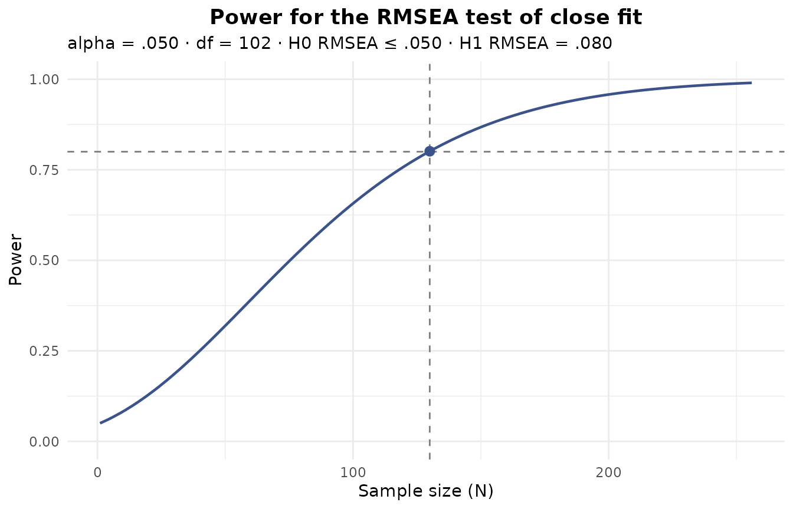
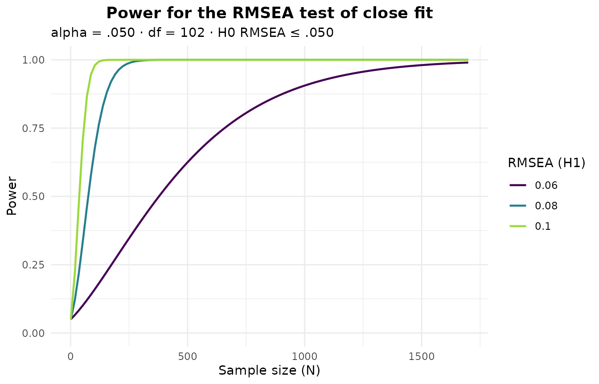

# Simulating data and power analysis for EFA

Simulation is the backbone of much of what we know about how exploratory
factor analysis behaves: which retention criterion to trust, how large a
sample a study needs, how badly non-normal or ordinal items distort a
solution. `EFAtools` gives you two tools for this work.
[`efa_simulate()`](https://mdsteiner.github.io/EFAtools/reference/efa_simulate.md)
draws data from a factor-model population you specify, with realistic
departures from the ideal – model error, non-normal or ordinal
marginals, missing values.
[`efa_power()`](https://mdsteiner.github.io/EFAtools/reference/efa_power.md)
answers the sample-size question, either analytically from the RMSEA
framework – which needs nothing but the model’s dimensions – or by
Monte-Carlo simulation of the whole retain-and-fit pipeline on a
population you specify.

``` r

library(EFAtools)
```

Throughout we use a three-factor population with six indicators per
factor, taken from the shipped `population_models` data set (a
collection of factor patterns and factor intercorrelation matrices used
in simulation studies). All indicators load `.6` on their factor, and
the factors correlate `.3`.

``` r

Lambda <- population_models$loadings$baseline   # 18 indicators, 3 factors
Phi    <- population_models$phis_3$moderate      # factor correlations of .3
```

## Simulating data with `efa_simulate()`

### Specifying the population

A population can be given in one of two mutually exclusive ways: as the
components of a factor model (`Lambda`, and optionally the factor
intercorrelations `Phi` and the unique variances `Psi`), or as a ready
population correlation matrix `R`. With the model components, the
population correlation is assembled as
$`R = \Lambda \Phi \Lambda' + \Psi`$ and standardized; when `Psi` is
left unset it is filled in with the unique variances that make the
population a correlation matrix.

``` r

sim <- efa_simulate(N = 500, Lambda = Lambda, Phi = Phi, seed = 42)
sim
#> ── Simulated data ──────────────────────────────────────────────────────────────
#> 
#> 500 cases by 18 variables (continuous).
#> Marginals: normal.
#> 
#> Model error: none (exact population).
```

The drawn data sit in `$data` – here a 500-by-18 numeric matrix – and
the population that was drawn from in `$population`.

``` r

dim(sim$data)
#> [1] 500  18
round(sim$population[1:6, 1:6], 2)
#>      V1   V2   V3   V4   V5   V6
#> V1 1.00 0.36 0.36 0.36 0.36 0.36
#> V2 0.36 1.00 0.36 0.36 0.36 0.36
#> V3 0.36 0.36 1.00 0.36 0.36 0.36
#> V4 0.36 0.36 0.36 1.00 0.36 0.36
#> V5 0.36 0.36 0.36 0.36 1.00 0.36
#> V6 0.36 0.36 0.36 0.36 0.36 1.00
```

If you only need the population correlation matrix – to inspect it, or
to feed it back in as an `R` population – set `return_pop = TRUE` and no
data are drawn:

``` r

R_pop <- efa_simulate(Lambda = Lambda, Phi = Phi, return_pop = TRUE)$population

# the same population can then be drawn from directly, via `R` instead of `Lambda`
sim_R <- efa_simulate(N = 500, R = R_pop, seed = 42)
dim(sim_R$data)
#> [1] 500  18
```

### Model error: realistic misfit

A population assembled exactly from a factor model fits that model
perfectly, which no real data set ever does. Simulating from an exact
population therefore overstates how well factor-retention criteria and
estimators recover the structure (MacCallum, 2003). To make a simulation
realistic,
[`efa_simulate()`](https://mdsteiner.github.io/EFAtools/reference/efa_simulate.md)
can perturb the population with *model error* so the factor model fits
it only approximately, at a misfit you control through `target_rmsea`
and/or `target_cfi`. Supplying a target is what switches model error on;
the achieved fit is computed with the same formulas
[`efa_fit()`](https://mdsteiner.github.io/EFAtools/reference/efa_fit.md)
uses and returned in `$model_error`.

``` r

sim_me <- efa_simulate(N = 500, Lambda = Lambda, Phi = Phi,
                       target_rmsea = 0.05, seed = 42)
sim_me
#> ── Simulated data ──────────────────────────────────────────────────────────────
#> 
#> 500 cases by 18 variables (continuous).
#> Marginals: normal.
#> 
#> Model error: CB
#> RMSEA: target .050, achieved .050
#> CFI: target --, achieved .936
```

Three methods are available through `model_error`. `"CB"` (Cudeck &
Browne, 1992; the default) matches the target RMSEA to numerical
precision and keeps the factor model the exact minimizer, so the CFI
follows as a derived quantity:

``` r

c(rmsea = sim_me$model_error$rmsea, cfi = sim_me$model_error$cfi)
#>     rmsea       cfi 
#> 0.0500000 0.9363534
```

`"TKL"` (Tucker, Koopman, & Linn, 1969) adds minor common factors and is
the only method that can target the CFI – on its own or, as here,
together with the RMSEA, in which case it trades the two off:

``` r

efa_simulate(N = 500, Lambda = Lambda, Phi = Phi, model_error = "TKL",
             target_rmsea = 0.05, target_cfi = 0.95, seed = 42)$model_error[c("rmsea", "cfi")]
#> $rmsea
#> [1] 0.0455728
#> 
#> $cfi
#> [1] 0.9479115
```

`"WB"` (Wu & Browne, 2015) draws the population once from an
inverse-Wishart distribution around the model-implied correlation. Being
a single random draw, its realized RMSEA varies around the target (and
tends to exceed it), so the value is reported rather than guaranteed:

``` r

efa_simulate(N = 500, Lambda = Lambda, Phi = Phi, model_error = "WB",
             target_rmsea = 0.05, seed = 42)$model_error$rmsea
#> [1] 0.06530353
```

Model error needs a factor-model population (there is no specified model
to misfit against a bare `R`) with residual degrees of freedom and an
exact factor structure (a diagonal `Psi`); it is orthogonal to the
marginal, ordinal, and missing-data options below.

### Non-normal marginals

By default the data are drawn with normal marginals. Real items –
especially Likert-type ones – are rarely normal, and non-normality
affects standard errors, fit indices, and the retention criteria.
[`efa_simulate()`](https://mdsteiner.github.io/EFAtools/reference/efa_simulate.md)
can reproduce the population correlation while giving the variables
non-normal marginals with a prescribed skewness and (excess) kurtosis,
via two methods. `marginals = "VM"` is the Vale-Maurelli (1983) method:

``` r

sk <- function(x) mean(((x - mean(x)) / sd(x))^3)   # skewness of one column
sim_vm <- efa_simulate(N = 500, Lambda = Lambda, Phi = Phi, marginals = "VM",
                       skewness = 1.5, kurtosis = 4, seed = 42)
round(c(target = 1.5, achieved = mean(apply(sim_vm$data, 2, sk))), 2)
#>   target achieved 
#>     1.50     1.57
```

`marginals = "IG"` is the independent-generator method (Foldnes &
Olsson, 2016), which covers non-normal distributions the Vale-Maurelli
family cannot. Not every (skewness, kurtosis) pair is attainable – every
distribution needs excess kurtosis of at least `skewness^2 - 2`, and
each method covers a smaller region still – so an unreachable request is
rejected with an informative error.

``` r

sim_ig <- efa_simulate(N = 500, Lambda = Lambda, Phi = Phi, marginals = "IG",
                       skewness = 1, kurtosis = 2, seed = 42)
round(c(target = 1, achieved = mean(apply(sim_ig$data, 2, sk))), 2)
#>   target achieved 
#>     1.00     0.96
```

A third option, `marginals = "empirical"`, reproduces the population
correlation while giving each variable the *empirical* marginal of a
supplied data set (Ruscio & Kaczetow, 2008) – useful when you want your
simulated variables to look exactly like real items. Only the marginals
of `marginal_data` are used; its own correlations are ignored.

``` r

set.seed(123)
src <- matrix(rchisq(500 * nrow(Lambda), df = 3), ncol = nrow(Lambda))  # skewed source
sim_emp <- efa_simulate(N = 500, Lambda = Lambda, Phi = Phi,
                        marginals = "empirical", marginal_data = src, seed = 42)
# the drawn data inherit the shape of the source, not of a normal
round(c(source = mean(apply(src, 2, sk)),
        simulated = mean(apply(sim_emp$data, 2, sk))), 2)
#>    source simulated 
#>      1.60      1.58
```

### Ordinal data

Setting `categories` discretizes the drawn data into ordered categories
– the ordinal items of a typical questionnaire. Give it a single count
(applied to every variable), one count per variable, or a list of
category-proportion vectors. How the categorization relates to the
population correlation is set by `match`.

With the default `match = "thresholds"`, the data are cut at fixed
thresholds on the standard-normal scale. Categorization attenuates
product-moment correlations, so the categorized data’s Pearson
correlation is smaller in magnitude than the population value:

``` r

sim_ord <- efa_simulate(N = 500, Lambda = Lambda, Phi = Phi, categories = 5, seed = 42)
# two indicators of the same factor: population vs. ordinal Pearson correlation
round(c(population = sim_ord$population[1, 2],
        ordinal    = cor(sim_ord$data)[1, 2]), 3)
#> population    ordinal 
#>      0.360      0.245
```

`match = "polychoric"` instead requires the latent to be normal, which
is exactly the condition under which the *polychoric* correlation of the
categorized data equals the target correlation. That is the guarantee
you want when the downstream analysis will use polychoric correlations
(`efa_fit(..., cor_method = "poly")`), because the estimated correlation
matrix then targets the true population rather than the attenuated one.
Because the guarantee rests on normality, the mode refuses to combine
with the non-normal marginals above – which is the point of asking for
it: under `marginals = "normal"` the draw itself is the same one
`"thresholds"` makes, so what you gain is the check, not a different
sampler.

``` r

sim_poly <- efa_simulate(N = 500, Lambda = Lambda, Phi = Phi, categories = 5,
                         match = "polychoric", seed = 42)
head(sim_poly$data[, 1:6])
#>      V1 V2 V3 V4 V5 V6
#> [1,]  3  5  4  4  4  5
#> [2,]  1  2  2  5  2  1
#> [3,]  2  1  4  1  3  4
#> [4,]  3  5  5  4  5  5
#> [5,]  2  2  3  3  2  1
#> [6,]  4  4  2  4  3  3
```

The recovery is a statement about the *population* polychoric, so it
shows up in a single sample only up to sampling error: at `N = 500` an
individual polychoric estimate still scatters noticeably around the
population value, while the Pearson correlation above is biased low no
matter how large the sample grows.

At small `N` or with many categories a draw can leave a category empty,
which destabilizes the polychoric correlation;
[`efa_simulate()`](https://mdsteiner.github.io/EFAtools/reference/efa_simulate.md)
warns when that happens, so keep `N` comfortably large for the number of
categories requested.

### Missing data

`missing` imposes a missing-data mechanism (Rubin, 1976) on the drawn
data, holing each variable at an expected rate `missing_prop`. `"MCAR"`
masks values completely at random:

``` r

sim_mcar <- efa_simulate(N = 500, Lambda = Lambda, Phi = Phi,
                         missing = "MCAR", missing_prop = 0.1, seed = 42)
round(colMeans(is.na(sim_mcar$data))[1:6], 3)
#>    V1    V2    V3    V4    V5    V6 
#> 0.104 0.104 0.120 0.100 0.098 0.102
```

`"MAR"` makes each variable’s missingness depend on *another* variable,
and `"MNAR"` on the variable’s *own* value, both through a logistic
model whose slope is set by `missing_strength`. The realized rate of a
given draw varies around the target.

``` r

sim_mar  <- efa_simulate(N = 500, Lambda = Lambda, Phi = Phi, missing = "MAR",
                         missing_prop = 0.15, seed = 42)
sim_mnar <- efa_simulate(N = 500, Lambda = Lambda, Phi = Phi, missing = "MNAR",
                         missing_prop = 0.15, missing_strength = 1.5, seed = 42)
round(c(MAR = mean(colMeans(is.na(sim_mar$data))),
        MNAR = mean(colMeans(is.na(sim_mnar$data)))), 3)
#>   MAR  MNAR 
#> 0.149 0.149
```

The returned matrix carries the `NA`s, which the correlation estimators
(pairwise deletion, FIML, and so on) handle downstream. See the [Ordinal
and missing
data](https://mdsteiner.github.io/EFAtools/articles/Ordinal_and_missing_data.md)
vignette for analysing such data.

### Several datasets and reproducibility

For a simulation study you need many datasets from the same population.
Set `n_datasets` and `$data` becomes a list:

``` r

sims <- efa_simulate(N = 300, Lambda = Lambda, Phi = Phi, n_datasets = 5, seed = 42)
length(sims$data)
#> [1] 5
dim(sims$data[[1]])
#> [1] 300  18
```

Replicated draws are dispatched across replicates with **future.apply**,
so selecting a parallel plan with
[`future::plan()`](https://future.futureverse.org/reference/plan.html)
runs them in parallel; the default plan is sequential. A fixed `seed`
assigns each replicate its own reproducible random-number stream, so the
output is identical no matter how many workers run it – and the same
call twice gives byte-identical data:

``` r

a <- efa_simulate(N = 300, Lambda = Lambda, Phi = Phi, seed = 42)
b <- efa_simulate(N = 300, Lambda = Lambda, Phi = Phi, seed = 42)
identical(a$data, b$data)
#> [1] TRUE
```

The seed is also restored afterwards, so the call leaves your own
random-number stream untouched.

## Power analysis with `efa_power()`

### Analytic RMSEA power

The fastest power analysis needs no simulation at all.
[`efa_power()`](https://mdsteiner.github.io/EFAtools/reference/efa_power.md)
(in its default `mode = "rmsea"`) implements the RMSEA power framework
of MacCallum, Browne, and Sugawara (1996), which refers the fit
statistic to a noncentral chi-square distribution. Two tests are
available. Under the **test of close fit**, the null hypothesis is that
the fit is close (RMSEA ≤ `eps0`, conventionally `.05`), and power is
the probability of rejecting that null when the true fit is worse
(`eps1`, conventionally `.08`) – that is, the probability of detecting a
model that is *not* close. The **test of not-close fit** reverses the
logic: its null is that the fit is not close (RMSEA ≥ `eps0`), tested
against a better alternative (`eps1`, conventionally `.01`).

Give a sample size to get the power at it. The model can be described
either by its degrees of freedom directly or by its dimensions – here
our 18-indicator, three-factor model:

``` r

efa_power(p = 18, k = 3, N = 200)
#> 
#> ── RMSEA power analysis ────────────────────────────────────────────────────────
#> 
#> Test of close fit: H0 RMSEA ≤ .050 vs. H1 RMSEA = .080.
#> alpha = .050 · df = 102
#> 
#> Power = .958 at N = 200.
#> Critical value χ²(102) = 187.289 · noncentrality H0 = 50.745, H1 = 129.907.
```

Leave `N` unset and give a target `power` instead to solve for the
smallest sample size that reaches it:

``` r

efa_power(p = 18, k = 3, power = 0.80)
#> 
#> ── RMSEA power analysis ────────────────────────────────────────────────────────
#> 
#> Test of close fit: H0 RMSEA ≤ .050 vs. H1 RMSEA = .080.
#> alpha = .050 · df = 102
#> 
#> Required N = 130 for a power of .800 (achieved .801).
#> Critical value χ²(102) = 166.326 · noncentrality H0 = 32.895, H1 = 84.211.
```

The test of not-close fit is selected with `type` (never by the ordering
of `eps0`/`eps1`):

``` r

efa_power(p = 18, k = 3, N = 200, type = "notclose")
#> 
#> ── RMSEA power analysis ────────────────────────────────────────────────────────
#> 
#> Test of not-close fit: H0 RMSEA ≥ .050 vs. H1 RMSEA = .010.
#> alpha = .050 · df = 102
#> 
#> Power = .876 at N = 200.
#> Critical value χ²(102) = 121.042 · noncentrality H0 = 50.745, H1 = 2.030.
```

For a multiple-group model, `group` divides the noncentrality across
groups. The reported `N` is the *total* across groups – 259 in all,
about 130 per group – and `N_per_group` carries that per-group figure:

``` r

pw_2g <- efa_power(p = 18, k = 3, power = 0.80, group = 2)
pw_2g
#> 
#> ── RMSEA power analysis ────────────────────────────────────────────────────────
#> 
#> Test of close fit: H0 RMSEA ≤ .050 vs. H1 RMSEA = .080.
#> alpha = .050 · df = 102 · groups = 2
#> 
#> Required N = 259 (total; 129.5 per group) for a power of .800 (achieved .801).
#> Critical value χ²(102) = 166.326 · noncentrality H0 = 32.895, H1 = 84.211.
pw_2g$N_per_group
#> [1] 129.5
```

The [`plot()`](https://rdrr.io/r/graphics/plot.default.html) method
draws power against sample size, marking the object’s own result. When a
sample size was solved for, it marks the target power and the required
`N`:

``` r

pw <- efa_power(p = 18, k = 3, power = 0.80)
plot(pw)
```



Sweeping the alternative RMSEA (or the degrees of freedom) overlays
several curves, which is a compact way to see how the required sample
size trades off against the effect you want to detect:

``` r

plot(pw, eps1 = c(0.06, 0.08, 0.10))
```



### Simulation-based power

The analytic power above is about a fit statistic. Often the real
question is different: how often will my factor-retention criteria point
to the right number of factors, and how well will the fitted loadings
recover the true pattern, at a given sample size? That needs a
Monte-Carlo study of the whole pipeline, which is what
`mode = "simulation"` runs. It draws `n_datasets` samples from the
population (via
[`efa_simulate()`](https://mdsteiner.github.io/EFAtools/reference/efa_simulate.md))
and, over the replicates, reports three things: the **hit-rate** of each
retention criterion (how often it recovers the true factor count),
**structure recovery** (how often the fitted loadings match the
population pattern by Tucker congruence), and the **convergence** and
Heywood-case rate of the fit.

By default the population fits the model exactly, which – as in
[`efa_simulate()`](https://mdsteiner.github.io/EFAtools/reference/efa_simulate.md)
– is optimistic. The printed summary says so:

``` r

efa_power("simulation", Lambda = Lambda, Phi = Phi, N = 300,
          n_datasets = 200, criteria = c("ekc", "map"), seed = 42)
#> 
#> ── EFA power simulation ────────────────────────────────────────────────────────
#> 
#> 18 variables · 3 factors · N = 300 · 200 datasets
#> Estimation: PAF · rotation: promax
#> Model error: none. The population is exact, so the hit-rate and recovery are
#> optimistic; set `target_rmsea` for realism.
#> 
#> Retention hit-rate P(k-hat = 3)
#> • EKC_BvA2017: .995 (n = 200)
#> • MAP_TR2: 1.000 (n = 200)
#> • MAP_TR4: 1.000 (n = 200)
#> 
#> Structure recovery (Tucker congruence ≥ .950)
#> • recovery rate (min congruence): 1.000 (n = 200)
#> • recovery rate (mean congruence): 1.000 (n = 200)
#> • median min congruence: .986
#> 
#> Convergence
#> • fits completed: 1.000 (200/200)
#> • converged (of completed): 1.000
#> • Heywood cases (of completed): .000
```

Supplying a misfit target makes the study realistic. In simulation mode
a target on its own activates model error with the `"TKL"` method by
default (it degrades both the hit-rate and recovery in a realistic way,
unlike `"CB"`, which keeps the fitted loadings the exact minimizer):

``` r

efa_power("simulation", Lambda = Lambda, Phi = Phi, N = 300,
          n_datasets = 200, criteria = c("ekc", "map"),
          target_rmsea = 0.05, seed = 42)
#> 
#> ── EFA power simulation ────────────────────────────────────────────────────────
#> 
#> 18 variables · 3 factors · N = 300 · 200 datasets
#> Estimation: PAF · rotation: promax
#> Model error (TKL): RMSEA = .050 · CFI = .936
#> 
#> Retention hit-rate P(k-hat = 3)
#> • EKC_BvA2017: .385 (n = 200)
#> • MAP_TR2: 1.000 (n = 200)
#> • MAP_TR4: .970 (n = 200)
#> 
#> Structure recovery (Tucker congruence ≥ .950)
#> • recovery rate (min congruence): .995 (n = 200)
#> • recovery rate (mean congruence): 1.000 (n = 200)
#> • median min congruence: .982
#> 
#> Convergence
#> • fits completed: 1.000 (200/200)
#> • converged (of completed): 1.000
#> • Heywood cases (of completed): .000
```

A few things to read off the output. The hit-rate is reported per
criterion, and per *variant* where a criterion has several (the
minimum-average-partial test reports its squared and fourth-power
variants, for example); its denominator is the number of replicates on
which the criterion returned a definite count, so a criterion that
errored or was undecided on some replicates is not silently penalised.
Structure recovery is available only for a factor-model population (a
bare `R` carries no loadings to recover); a replicate counts as
recovered when its matched-factor Tucker congruence reaches
`recovery_threshold`, which defaults to the `.95` that Lorenzo-Seva and
ten Berge (2006) read as factors that can be considered equal. Here the
strong `.6` loadings make recovery near-perfect even under model error,
while the criteria disagree markedly – exactly the kind of finding a
power study exists to surface.

**On the number of datasets.** We use `n_datasets = 200` here purely so
the article builds quickly. A real power study should use the default of
`500`, and preferably more, to pin the rates down. We also evaluate only
the two fastest criteria, `"EKC"` and `"MAP"`; the criteria that run
their own internal simulation on every replicate – comparison data
(`"CD"`), the hull method (`"HULL"`), the next-eigenvalue sufficiency
test (`"NEST"`), and parallel analysis (`"PARALLEL"`) – multiply the
cost substantially. As in
[`efa_simulate()`](https://mdsteiner.github.io/EFAtools/reference/efa_simulate.md),
a `seed` makes the whole study reproducible and independent of the
number of parallel workers.

## Where to next

[`efa_simulate()`](https://mdsteiner.github.io/EFAtools/reference/efa_simulate.md)
and
[`efa_power()`](https://mdsteiner.github.io/EFAtools/reference/efa_power.md)
carry more options than shown here – per-variable moments, category
proportions, MAR predictors, the choice of estimator and rotation for
the recovery fit. See
[`?efa_simulate`](https://mdsteiner.github.io/EFAtools/reference/efa_simulate.md)
and
[`?efa_power`](https://mdsteiner.github.io/EFAtools/reference/efa_power.md)
for the full argument lists and the structure of the returned objects,
the
[EFAtools](https://mdsteiner.github.io/EFAtools/articles/EFAtools.md)
vignette for the analysis workflow these studies evaluate, and the
[Ordinal and missing
data](https://mdsteiner.github.io/EFAtools/articles/Ordinal_and_missing_data.md)
vignette for fitting the ordinal and incomplete data simulated above.

## References

Cudeck, R., & Browne, M. W. (1992). Constructing a covariance matrix
that yields a specified minimizer and a specified minimum discrepancy
function value. *Psychometrika*, 57, 357-369.

Foldnes, N., & Olsson, U. H. (2016). A simple simulation technique for
nonnormal data with prespecified skewness, kurtosis, and covariance
matrix. *Multivariate Behavioral Research*, 51, 207-219.

Lorenzo-Seva, U., & ten Berge, J. M. F. (2006). Tucker’s congruence
coefficient as a meaningful index of factor similarity. *Methodology*,
2, 57-64.

MacCallum, R. C. (2003). Working with imperfect models. *Multivariate
Behavioral Research*, 38, 113-139.

MacCallum, R. C., Browne, M. W., & Sugawara, H. M. (1996). Power
analysis and determination of sample size for covariance structure
modeling. *Psychological Methods*, 1, 130-149.

Rubin, D. B. (1976). Inference and missing data. *Biometrika*, 63,
581-592.

Ruscio, J., & Kaczetow, W. (2008). Simulating multivariate nonnormal
data using an iterative algorithm. *Multivariate Behavioral Research*,
43, 355-381.

Tucker, L. R., Koopman, R. F., & Linn, R. L. (1969). Evaluation of
factor analytic research procedures by means of simulated correlation
matrices. *Psychometrika*, 34, 421-459.

Vale, C. D., & Maurelli, V. A. (1983). Simulating multivariate nonnormal
distributions. *Psychometrika*, 48, 465-471.

Wu, H., & Browne, M. W. (2015). Quantifying adventitious error in a
covariance structure as a random effect. *Psychometrika*, 80, 571-600.
